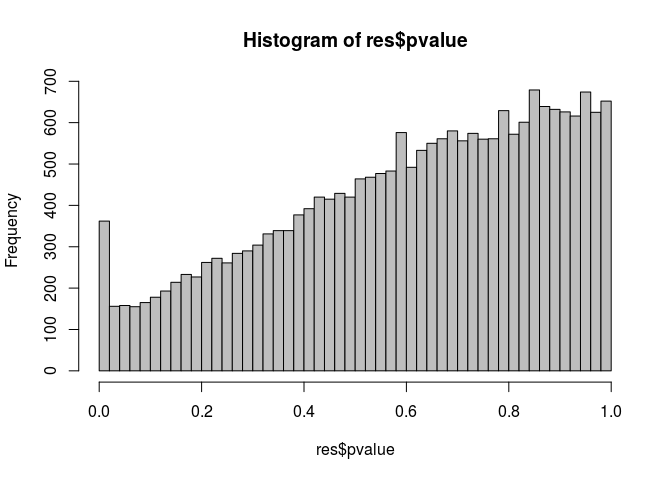
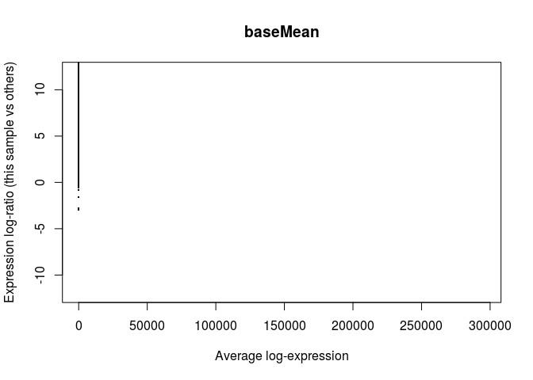
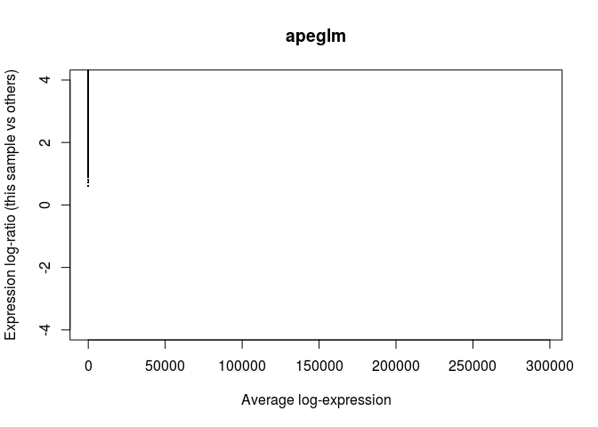
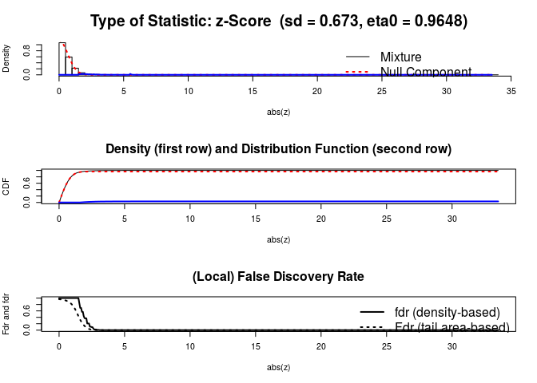
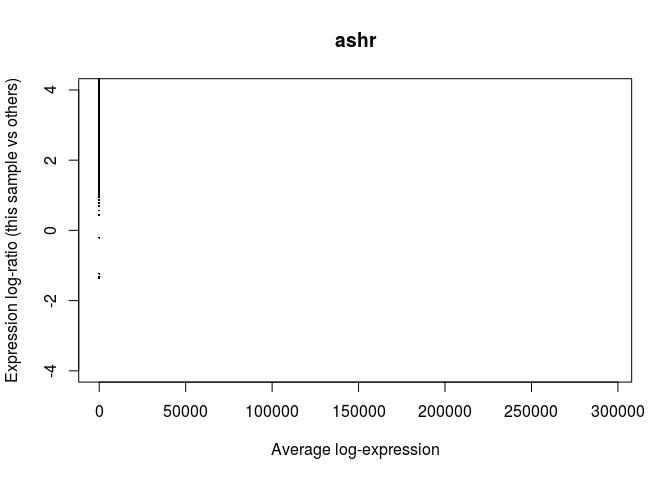
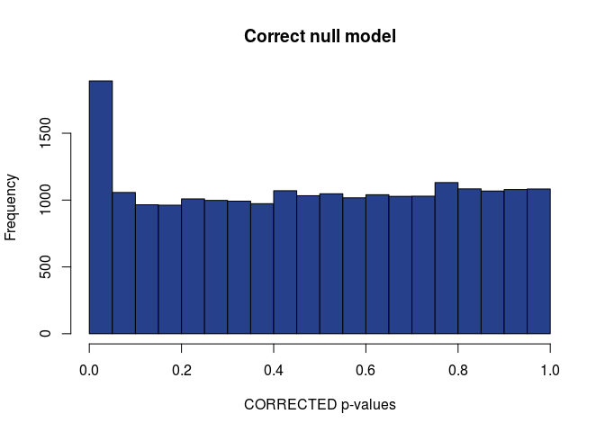
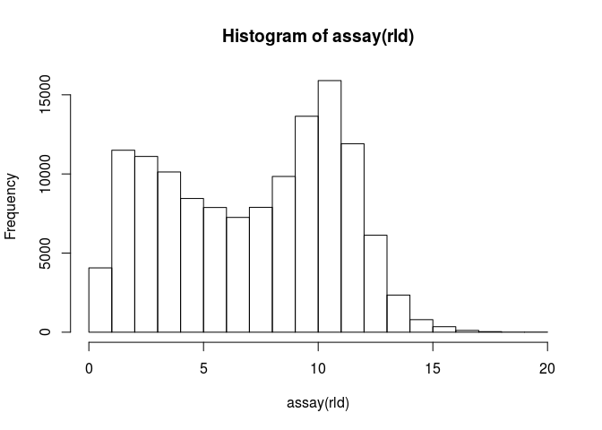
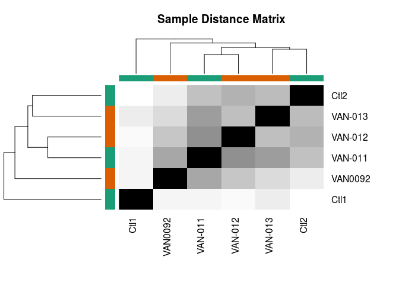
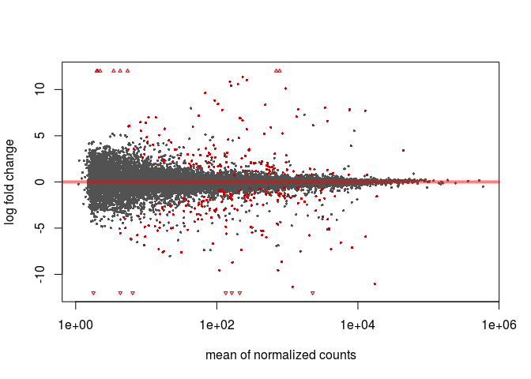

RNAcocktail\_analysis
================
German Novakovskiy
June 9, 2018

RNA-seq analysis with DESeq2
============================

``` r
suppressMessages(suppressWarnings(library(dplyr)))
suppressMessages(suppressWarnings(library(knitr)))
suppressMessages(suppressWarnings(library(tximport)))
suppressMessages(suppressWarnings(library(DESeq2)))
suppressMessages(suppressWarnings(library(edgeR)))
suppressMessages(suppressWarnings(library(tibble)))
suppressMessages(suppressWarnings(library(reshape2)))
suppressMessages(suppressWarnings(library(ggplot2)))
suppressMessages(suppressWarnings(library(RColorBrewer)))
suppressMessages(suppressWarnings(library(ermineR)))
suppressMessages(suppressWarnings(library(tidyverse)))
suppressMessages(suppressWarnings(library(tximport)))
suppressMessages(suppressWarnings(library(readr)))
suppressMessages(suppressWarnings(library(tximportData)))
suppressMessages(suppressWarnings(library(GenomicFeatures)))
suppressMessages(suppressWarnings(library(biomaRt)))
suppressMessages(suppressWarnings(library(gplots)))
```

Running RNAcocktail with SALMON-SMEM
------------------------------------

For running delete all comment symbols (\#) except the first line (I used version 67 from ensembl website; new version 92 is available).

``` bash
#!/bin/bash

#samples=($(ls raw_reads))

#for i in "${samples[@]}"
#do
        #TEST1=$(ls raw_reads/"$i"/*R1* | tr '\n' ' ' | \
        #awk '{for(i=1;i<=NF;i++){printf $i;if(i<NF)printf ","}}')

        #TEST2=$(ls raw_reads/"$i"/*R2* | tr '\n' ' ' | \
        #awk '{for(i=1;i<=NF;i++){printf $i;if(i<NF)printf ","}}')

        #run_rnacocktail.py quantify --quantifier_idx human_transcriptome_19_index/ --1 $TEST1 --2 $TEST2 \
        #--libtype ISR --salmon_k 19 --outdir salmon_out --workdir salmon_work --sample $i --unzip

        #echo '\n'
        #echo '\n'
        #echo "Done with $i"
        #echo '\n'
        #echo '\n'
#done
```

Analysis of quant data with DESeq2
----------------------------------

``` r
#metadata construction
samples <- c("Ctl1-1", "Ctl1-2", "Ctl2-1", "Ctl2-2", "VAN-011-1", "VAN-011-2",
             "VAN-012-1", "VAN-012-2", "VAN-013-1", "VAN-013-2", "VAN0092", "VAN3360091")
sex <- c("M", "M", "M", "M", "F", "F", "F", "F", "M", "M", "F", "F")
national <- c("Caucasian", "Caucasian", "Asian", "Asian",
              "Caucasian", "Caucasian", "Caucasian", "Caucasian",
              "Caucasian", "Caucasian", "Caucasian", "Caucasian")
relation <- c("NoFamily", "NoFamily", "NoFamily", "NoFamily",
              "Family", "Family", "Family", "Family",
              "Family", "Family", "Family", "Family")

#1 is affected, 0 if not
affected <- c(0, 0, 0, 0, 1, 1, 0, 0, 1, 1, 1, 1)
metadata <- data.frame(Samples = samples, National = national,
                       Relation = relation, Sex = sex, Affected = affected)
metadata$Affected <- as.factor(metadata$Affected)
rownames(metadata) <- samples
metadata
```

    ##               Samples  National Relation Sex Affected
    ## Ctl1-1         Ctl1-1 Caucasian NoFamily   M        0
    ## Ctl1-2         Ctl1-2 Caucasian NoFamily   M        0
    ## Ctl2-1         Ctl2-1     Asian NoFamily   M        0
    ## Ctl2-2         Ctl2-2     Asian NoFamily   M        0
    ## VAN-011-1   VAN-011-1 Caucasian   Family   F        1
    ## VAN-011-2   VAN-011-2 Caucasian   Family   F        1
    ## VAN-012-1   VAN-012-1 Caucasian   Family   F        0
    ## VAN-012-2   VAN-012-2 Caucasian   Family   F        0
    ## VAN-013-1   VAN-013-1 Caucasian   Family   M        1
    ## VAN-013-2   VAN-013-2 Caucasian   Family   M        1
    ## VAN0092       VAN0092 Caucasian   Family   F        1
    ## VAN3360091 VAN3360091 Caucasian   Family   F        1

``` r
#files, output from Salmon-SMEM
dir <- "~/RNA-seq_Cynthia/salmon_out"
files <- file.path(dir,"salmon_smem", metadata$Samples, "quant.sf")
files
```

    ##  [1] "~/RNA-seq_Cynthia/salmon_out/salmon_smem/Ctl1-1/quant.sf"    
    ##  [2] "~/RNA-seq_Cynthia/salmon_out/salmon_smem/Ctl1-2/quant.sf"    
    ##  [3] "~/RNA-seq_Cynthia/salmon_out/salmon_smem/Ctl2-1/quant.sf"    
    ##  [4] "~/RNA-seq_Cynthia/salmon_out/salmon_smem/Ctl2-2/quant.sf"    
    ##  [5] "~/RNA-seq_Cynthia/salmon_out/salmon_smem/VAN-011-1/quant.sf" 
    ##  [6] "~/RNA-seq_Cynthia/salmon_out/salmon_smem/VAN-011-2/quant.sf" 
    ##  [7] "~/RNA-seq_Cynthia/salmon_out/salmon_smem/VAN-012-1/quant.sf" 
    ##  [8] "~/RNA-seq_Cynthia/salmon_out/salmon_smem/VAN-012-2/quant.sf" 
    ##  [9] "~/RNA-seq_Cynthia/salmon_out/salmon_smem/VAN-013-1/quant.sf" 
    ## [10] "~/RNA-seq_Cynthia/salmon_out/salmon_smem/VAN-013-2/quant.sf" 
    ## [11] "~/RNA-seq_Cynthia/salmon_out/salmon_smem/VAN0092/quant.sf"   
    ## [12] "~/RNA-seq_Cynthia/salmon_out/salmon_smem/VAN3360091/quant.sf"

Using tximport package to load Salmon data:

``` r
names(files) <- metadata$Samples
TxDb <- makeTxDbFromGFF(file = "genes_19.gtf")
```

    ## Import genomic features from the file as a GRanges object ... OK
    ## Prepare the 'metadata' data frame ... OK
    ## Make the TxDb object ...

    ## Warning in .get_cds_IDX(type, phase): The "phase" metadata column contains non-NA values for features of
    ##   type stop_codon. This information was ignored.

    ## OK

``` r
k <- keys(TxDb, keytype = "TXNAME")
tx2gene <- select(TxDb, k, "GENEID", "TXNAME")
```

    ## 'select()' returned 1:1 mapping between keys and columns

``` r
head(tx2gene)
```

    ##            TXNAME          GENEID
    ## 1 ENST00000456328 ENSG00000223972
    ## 2 ENST00000515242 ENSG00000223972
    ## 3 ENST00000518655 ENSG00000223972
    ## 4 ENST00000450305 ENSG00000223972
    ## 5 ENST00000473358 ENSG00000243485
    ## 6 ENST00000469289 ENSG00000243485

``` r
txi <- tximport(files, type = "salmon", tx2gene = tx2gene, ignoreTxVersion = TRUE)
```

    ## reading in files with read_tsv

    ## 1 2 3 4 5 6 7 8 9 10 11 12 
    ## summarizing abundance
    ## summarizing counts
    ## summarizing length

Let's construct a DESeqDataSet from the txi object and sample information in metadata:

``` r
ddsTxi <- DESeqDataSetFromTximport(txi,
                                   colData = metadata,
                                   design = ~ Sex + Affected)
```

    ## using counts and average transcript lengths from tximport

Pre-filtering
-------------

Filtering of low-expressed genes

``` r
keep <- rowSums(counts(ddsTxi)) >= 10
ddsTxi <- ddsTxi[keep,]
dim(counts(ddsTxi))
```

    ## [1] 21556    12

Collapsing technical replicates
-------------------------------

We have technical replicates for each individual:

``` r
ddsTxi$Samples <- factor(c("Ctl1", "Ctl1", "Ctl2", "Ctl2", "VAN-011", "VAN-011", "VAN-012", "VAN-012", "VAN-013", "VAN-013", "VAN0092", "VAN0092"))
ddsTxi$Run <- paste0("run",1:12)
colData(ddsTxi)
```

    ## DataFrame with 12 rows and 6 columns
    ##             Samples  National Relation      Sex Affected         Run
    ##            <factor>  <factor> <factor> <factor> <factor> <character>
    ## Ctl1-1         Ctl1 Caucasian NoFamily        M        0        run1
    ## Ctl1-2         Ctl1 Caucasian NoFamily        M        0        run2
    ## Ctl2-1         Ctl2     Asian NoFamily        M        0        run3
    ## Ctl2-2         Ctl2     Asian NoFamily        M        0        run4
    ## VAN-011-1   VAN-011 Caucasian   Family        F        1        run5
    ## ...             ...       ...      ...      ...      ...         ...
    ## VAN-012-2   VAN-012 Caucasian   Family        F        0        run8
    ## VAN-013-1   VAN-013 Caucasian   Family        M        1        run9
    ## VAN-013-2   VAN-013 Caucasian   Family        M        1       run10
    ## VAN0092     VAN0092 Caucasian   Family        F        1       run11
    ## VAN3360091  VAN0092 Caucasian   Family        F        1       run12

``` r
#sum up technical replicates
ddsTxi <- collapseReplicates(ddsTxi, ddsTxi$Samples, ddsTxi$Run)
colData(ddsTxi)
```

    ## DataFrame with 6 rows and 7 columns
    ##          Samples  National Relation      Sex Affected         Run
    ##         <factor>  <factor> <factor> <factor> <factor> <character>
    ## Ctl1        Ctl1 Caucasian NoFamily        M        0        run1
    ## Ctl2        Ctl2     Asian NoFamily        M        0        run3
    ## VAN0092  VAN0092 Caucasian   Family        F        1       run11
    ## VAN-011  VAN-011 Caucasian   Family        F        1        run5
    ## VAN-012  VAN-012 Caucasian   Family        F        0        run7
    ## VAN-013  VAN-013 Caucasian   Family        M        1        run9
    ##         runsCollapsed
    ##           <character>
    ## Ctl1        run1,run2
    ## Ctl2        run3,run4
    ## VAN0092   run11,run12
    ## VAN-011     run5,run6
    ## VAN-012     run7,run8
    ## VAN-013    run9,run10

Differential expression
-----------------------

``` r
#actual DE analysis
ddsTxi <- DESeq(ddsTxi)
```

    ## estimating size factors

    ## using 'avgTxLength' from assays(dds), correcting for library size

    ## estimating dispersions

    ## gene-wise dispersion estimates

    ## mean-dispersion relationship

    ## final dispersion estimates

    ## fitting model and testing

``` r
res <- results(ddsTxi, name="Affected_1_vs_0")
res
```

    ## log2 fold change (MLE): Affected 1 vs 0 
    ## Wald test p-value: Affected 1 vs 0 
    ## DataFrame with 21556 rows and 6 columns
    ##                    baseMean log2FoldChange     lfcSE        stat    pvalue
    ##                   <numeric>      <numeric> <numeric>   <numeric> <numeric>
    ## ENSG00000000003    2.614282     -0.1393123 2.1043097 -0.06620333 0.9472159
    ## ENSG00000000419 1541.902334     -0.1196105 0.2116908 -0.56502440 0.5720572
    ## ENSG00000000457  760.171992     -0.2295006 0.2160748 -1.06213487 0.2881745
    ## ENSG00000000460  905.000001     -0.0489697 0.2453854 -0.19956242 0.8418228
    ## ENSG00000000938 2511.248366     -0.7104193 0.5498190 -1.29209661 0.1963237
    ## ...                     ...            ...       ...         ...       ...
    ## ENSG00000263335   26.685662     0.77804413 0.9501666   0.8188502 0.4128719
    ## ENSG00000263340   20.309421     0.22479242 0.6526104   0.3444512 0.7305070
    ## ENSG00000263341    5.656033    -3.47417258 4.1415627  -0.8388555 0.4015504
    ## ENSG00000263344 7125.384971     0.04591577 0.1561821   0.2939888 0.7687665
    ## ENSG00000263345   23.761441     0.77179082 0.7219155   1.0690874 0.2850303
    ##                      padj
    ##                 <numeric>
    ## ENSG00000000003 0.9999121
    ## ENSG00000000419 0.9999121
    ## ENSG00000000457 0.9999121
    ## ENSG00000000460 0.9999121
    ## ENSG00000000938 0.9999121
    ## ...                   ...
    ## ENSG00000263335 0.9999121
    ## ENSG00000263340 0.9999121
    ## ENSG00000263341 0.9999121
    ## ENSG00000263344 0.9999121
    ## ENSG00000263345 0.9999121

``` r
#adjusted p-value threshold
res05 <- results(ddsTxi, alpha=0.05)
summary(res05)
```

    ## 
    ## out of 21556 with nonzero total read count
    ## adjusted p-value < 0.05
    ## LFC > 0 (up)     : 59, 0.27% 
    ## LFC < 0 (down)   : 43, 0.2% 
    ## outliers [1]     : 0, 0% 
    ## low counts [2]   : 0, 0% 
    ## (mean count < 1)
    ## [1] see 'cooksCutoff' argument of ?results
    ## [2] see 'independentFiltering' argument of ?results

Only 59 genes are up-regulated, while 43 are down-regulated.

``` r
sum(res05$padj < 0.05, na.rm=TRUE)
```

    ## [1] 102

Examine plot of p-values:

``` r
hist(res$pvalue, breaks=50, col="grey")
```



Log fold change shrinkage for visualization and ranking
-------------------------------------------------------

Shrinkage of effect size (LFC estimates) is useful for visualization and ranking of genes. To shrink the LFC, we pass the dds object to the function lfcShrink. Below we specify to use the apeglm method for effect size shrinkage (Zhu, Ibrahim, and Love 2018), which improves on the previous estimator.

``` r
resultsNames(ddsTxi)
```

    ## [1] "Intercept"       "Sex_M_vs_F"      "Affected_1_vs_0"

``` r
resLFC <- lfcShrink(ddsTxi, coef="Affected_1_vs_0", type="apeglm")
```

    ## using 'apeglm' for LFC shrinkage

``` r
resLFC
```

    ## log2 fold change (MAP): Affected 1 vs 0 
    ## Wald test p-value: Affected 1 vs 0 
    ## DataFrame with 21556 rows and 5 columns
    ##                    baseMean log2FoldChange       lfcSE    pvalue      padj
    ##                   <numeric>      <numeric>   <numeric> <numeric> <numeric>
    ## ENSG00000000003    2.614282  -4.470158e-08 0.001608245 0.9472159 0.9999121
    ## ENSG00000000419 1541.902334  -3.828836e-06 0.001608205 0.5720572 0.9999121
    ## ENSG00000000457  760.171992  -7.308361e-06 0.001608215 0.2881745 0.9999121
    ## ENSG00000000460  905.000001  -1.594700e-06 0.001608213 0.8418228 0.9999121
    ## ENSG00000000938 2511.248366  -2.892116e-06 0.001608242 0.1963237 0.9999121
    ## ...                     ...            ...         ...       ...       ...
    ## ENSG00000263335   26.685662   6.431199e-07 0.001608244 0.4128719 0.9999121
    ## ENSG00000263340   20.309421   6.755381e-07 0.001608241 0.7305070 0.9999121
    ## ENSG00000263341    5.656033  -1.756836e-07 0.001608246 0.4015504 0.9999121
    ## ENSG00000263344 7125.384971   3.928961e-06 0.001608165 0.7687665 0.9999121
    ## ENSG00000263345   23.761441   2.757972e-06 0.001608244 0.2850303 0.9999121

MA plot
-------

The function plotMA shows the log2 fold changes attributable to a given variable over the mean of normalized counts for all the samples in the DESeqDataSet. Points will be colored red if the adjusted p value is less than 0.05 (for this threshold). Points which fall out of the window are plotted as open triangles pointing either up or down. (<https://support.bioconductor.org/p/93148/>)

``` r
plotMA(res, alpha = 0.05, ylim=c(-12,12))
```

    ## Warning in plot.window(...): "alpha" is not a graphical parameter

    ## Warning in plot.xy(xy, type, ...): "alpha" is not a graphical parameter

    ## Warning in axis(side = side, at = at, labels = labels, ...): "alpha" is not
    ## a graphical parameter

    ## Warning in axis(side = side, at = at, labels = labels, ...): "alpha" is not
    ## a graphical parameter

    ## Warning in box(...): "alpha" is not a graphical parameter

    ## Warning in title(...): "alpha" is not a graphical parameter



It is more useful visualize the MA-plot for the shrunken log2 fold changes, which remove the noise associated with log2 fold changes from low count genes without requiring arbitrary filtering thresholds. (The large fold changes from genes with lots of statistical information are not shrunk, while the imprecise fold changes are shrunk).

``` r
plotMA(resLFC, ylim=c(-4,4), main = "apeglm")
```

 We probably see the plot like this, because nearly all genes have no change of expression and there is little to no variation across replicates (so near technical replication); the same pattern was found by limma. And we have small number of genes with very large fold changes (see the above plot).

We can do LFC shrinkage with different methods, but apeglm is considered to be better (I didn't go deep into this). For comparison shrinkage with other methods:

``` r
resLFCnormal <- lfcShrink(ddsTxi, coef="Affected_1_vs_0", type="normal")
plotMA(resLFCnormal, ylim=c(-4,4), main = "normal")
```



``` r
resLFCashr <- lfcShrink(ddsTxi, coef="Affected_1_vs_0", type="ashr")
```

    ## using 'ashr' for LFC shrinkage. If used in published research, please cite:
    ##     Stephens, M. (2016) False discovery rates: a new deal. Biostatistics, 18:2.
    ##     https://doi.org/10.1093/biostatistics/kxw041

    ## Due to absence of package REBayes, switching to EM algorithm

``` r
plotMA(resLFCashr, ylim=c(-4,4), main = "ashr")
```



Count plot of one gene with the lowest adjusted (multiple test correction) pvalue (remember, 0 is unaffected, 1 is affected):

``` r
plotCounts(ddsTxi, gene=which.min(res$padj), intgroup="Affected")
```

 ENSG00000233841 is a HLA-C gene. (set returnData=TRUE for custom plots)

Some pictures
-------------

``` r
plotDispEsts(ddsTxi, main="Dispersion plot")
```



``` r
#Regularized log transformation for clustering/heatmaps, etc
#produces transformed data on the log2 scale which has been normalized with 
#respect to library size or other normalization factors.
rld <- rlogTransformation(ddsTxi)
head(assay(rld))
```

    ##                      Ctl1      Ctl2   VAN0092   VAN-011   VAN-012
    ## ENSG00000000003  1.312446  1.382763  1.283655  1.350900  1.300791
    ## ENSG00000000419 10.567924 10.810579 10.589912 10.477441 10.525904
    ## ENSG00000000457  9.702070  9.599486  9.321337  9.557868  9.638015
    ## ENSG00000000460  9.676775  9.967269  9.951230  9.796487  9.797046
    ## ENSG00000000938 12.159778 10.598002 10.795354 10.762131 11.194892
    ## ENSG00000001036 10.180975 10.266098 10.053624 10.050968 10.178690
    ##                   VAN-013
    ## ENSG00000000003  1.314253
    ## ENSG00000000419 10.522479
    ## ENSG00000000457  9.544236
    ## ENSG00000000460  9.687536
    ## ENSG00000000938 11.053404
    ## ENSG00000001036 10.038137

``` r
hist(assay(rld))
```



``` r
condition <- factor(c(0, 0, 1, 0, 1, 1))
mycols <- brewer.pal(8, "Dark2")[1:length(unique(condition))]

# Sample distance heatmap
sampleDists <- as.matrix(dist(t(assay(rld))))
heatmap.2(as.matrix(sampleDists), key=F, trace="none",
          col=colorpanel(100, "black", "white"),
          ColSideColors=mycols[condition], RowSideColors=mycols[condition],
          margin=c(10, 10), main="Sample Distance Matrix")
```

 PCA plot:

``` r
plotPCA(rld, intgroup=c("Affected"))
```



Write results to file
---------------------

order by adjusted pvalue

``` r
resOrdered <- res[order(res$padj),]
results <- as.data.frame(resOrdered)
results <- results %>% rownames_to_column("ensgene") %>% filter(padj < 0.05)

ensembl = useEnsembl(biomart="ensembl", dataset="hsapiens_gene_ensembl")
hgnc_genes <- getBM(attributes=c('ensembl_gene_id','gene_biotype','hgnc_symbol','chromosome_name','description'), filters = 'ensembl_gene_id', values = results$ensgene, mart = ensembl)

hgnc_genes
```

    ##    ensembl_gene_id                       gene_biotype  hgnc_symbol
    ## 1  ENSG00000064886                     protein_coding       CHI3L2
    ## 2  ENSG00000082805                     protein_coding         ERC1
    ## 3  ENSG00000096155                     protein_coding         BAG6
    ## 4  ENSG00000100376                     protein_coding      FAM118A
    ## 5  ENSG00000105971                     protein_coding         CAV2
    ## 6  ENSG00000106780                     protein_coding        MEGF9
    ## 7  ENSG00000129204                     protein_coding         USP6
    ## 8  ENSG00000134184                     protein_coding        GSTM1
    ## 9  ENSG00000135114                     protein_coding         OASL
    ## 10 ENSG00000137331                     protein_coding         IER3
    ## 11 ENSG00000137507                     protein_coding       LRRC32
    ## 12 ENSG00000146112                     protein_coding      PPP1R18
    ## 13 ENSG00000148291                     protein_coding        SURF2
    ## 14 ENSG00000148300                     protein_coding        REXO4
    ## 15 ENSG00000149054                     protein_coding       ZNF215
    ## 16 ENSG00000151303               processed_transcript             
    ## 17 ENSG00000164692                     protein_coding       COL1A2
    ## 18 ENSG00000173809                     protein_coding       TDRD12
    ## 19 ENSG00000177697                     protein_coding        CD151
    ## 20 ENSG00000179750                     protein_coding     APOBEC3B
    ## 21 ENSG00000204252                     protein_coding      HLA-DOA
    ## 22 ENSG00000204256                     protein_coding         BRD2
    ## 23 ENSG00000204351                     protein_coding       SKIV2L
    ## 24 ENSG00000204619                     protein_coding      PPP1R11
    ## 25 ENSG00000205464                     protein_coding     ATP6AP1L
    ## 26 ENSG00000206281                     protein_coding        TAPBP
    ## 27 ENSG00000206285                     protein_coding      B3GALT4
    ## 28 ENSG00000206305                     protein_coding     HLA-DQA1
    ## 29 ENSG00000206315                     protein_coding         PBX2
    ## 30 ENSG00000206427                     protein_coding       PRRC2A
    ## 31 ENSG00000206446               processed_transcript    HLA-F-AS1
    ## 32 ENSG00000212866                     protein_coding       HSPA1B
    ## 33 ENSG00000215559 transcribed_unprocessed_pseudogene  ANKRD20A11P
    ## 34 ENSG00000223481                     protein_coding         TAP2
    ## 35 ENSG00000224320                     protein_coding        HLA-A
    ## 36 ENSG00000224379                     protein_coding        TCF19
    ## 37 ENSG00000224501                     protein_coding       HSPA1B
    ## 38 ENSG00000224859                     protein_coding        ZNRD1
    ## 39 ENSG00000225060                     protein_coding      PPP1R18
    ## 40 ENSG00000225164                     protein_coding       PRRC2A
    ## 41 ENSG00000225824                     protein_coding     HLA-DQB1
    ## 42 ENSG00000225890                     protein_coding     HLA-DQA1
    ## 43 ENSG00000225967                     protein_coding         TAP2
    ## 44 ENSG00000226152             unprocessed_pseudogene       HCG4P7
    ## 45 ENSG00000227315                     protein_coding         NEU1
    ## 46 ENSG00000227739                     protein_coding         TUBB
    ## 47 ENSG00000227761                     protein_coding         BAG6
    ## 48 ENSG00000227827             unprocessed_pseudogene             
    ## 49 ENSG00000228314 transcribed_unprocessed_pseudogene     CYP4F29P
    ## 50 ENSG00000228405                     protein_coding         RNF5
    ## 51 ENSG00000228435                     protein_coding      C6orf47
    ## 52 ENSG00000228490             unprocessed_pseudogene       HCG4P7
    ## 53 ENSG00000228570                     protein_coding       NUTM2E
    ## 54 ENSG00000228760                     protein_coding         BAG6
    ## 55 ENSG00000229215                     protein_coding        HLA-A
    ## 56 ENSG00000229998                     protein_coding      PPP1R18
    ## 57 ENSG00000230141                     protein_coding      HLA-DOA
    ## 58 ENSG00000230230                     protein_coding       TRIM26
    ## 59 ENSG00000230389               processed_transcript         HCP5
    ## 60 ENSG00000230685                     protein_coding        CLIC1
    ## 61 ENSG00000231247                     protein_coding      PPP1R18
    ## 62 ENSG00000231825                     protein_coding       PRRC2A
    ## 63 ENSG00000232005                     protein_coding         PBX2
    ## 64 ENSG00000232280                     protein_coding        FLOT1
    ## 65 ENSG00000232326                     protein_coding         TAP2
    ## 66 ENSG00000232962                     protein_coding      HLA-DOA
    ## 67 ENSG00000233381               processed_pseudogene        AK4P3
    ## 68 ENSG00000233841                     protein_coding        HLA-C
    ## 69 ENSG00000234218                     protein_coding         MICB
    ## 70 ENSG00000234539                     protein_coding        ATF6B
    ## 71 ENSG00000234651                     protein_coding         BAG6
    ## 72 ENSG00000234704                     protein_coding         BRD2
    ## 73 ENSG00000235222                     protein_coding         MSH5
    ## 74 ENSG00000235657                     protein_coding        HLA-A
    ## 75 ENSG00000235986                     protein_coding         GNL1
    ## 76 ENSG00000236011                     protein_coding       GPANK1
    ## 77 ENSG00000236090               processed_pseudogene       LDHAP3
    ## 78 ENSG00000236418                     protein_coding     HLA-DQA1
    ## 79 ENSG00000236552               processed_pseudogene     RPL13AP5
    ## 80 ENSG00000236884                     protein_coding     HLA-DRB1
    ## 81 ENSG00000237105               processed_transcript         HCP5
    ## 82 ENSG00000237344                     protein_coding         PBX2
    ## 83 ENSG00000237724                     protein_coding       HSPA1A
    ## 84 ENSG00000241386                     protein_coding      HLA-DOB
    ## 85 ENSG00000241713                     protein_coding       LY6G5B
    ## 86 ENSG00000243492 transcribed_unprocessed_pseudogene        HLA-L
    ## 87 ENSG00000243496                     protein_coding      HLA-DOB
    ## 88 ENSG00000248769             unprocessed_pseudogene             
    ## 89 ENSG00000251624             unprocessed_pseudogene      UNC93B7
    ## 90 ENSG00000254405                     protein_coding  MSH5-SAPCD1
    ## 91 ENSG00000257473                     protein_coding     HLA-DQA2
    ## 92 ENSG00000258588                     protein_coding TRIM6-TRIM34
    ##             chromosome_name
    ## 1                         1
    ## 2                        12
    ## 3   CHR_HSCHR6_MHC_QBL_CTG1
    ## 4                        22
    ## 5                         7
    ## 6                         9
    ## 7                        17
    ## 8                         1
    ## 9                        12
    ## 10                        6
    ## 11                       11
    ## 12                        6
    ## 13                        9
    ## 14                        9
    ## 15                       11
    ## 16                       10
    ## 17                        7
    ## 18                       19
    ## 19                       11
    ## 20                       22
    ## 21                        6
    ## 22                        6
    ## 23                        6
    ## 24                        6
    ## 25                        5
    ## 26  CHR_HSCHR6_MHC_QBL_CTG1
    ## 27  CHR_HSCHR6_MHC_QBL_CTG1
    ## 28  CHR_HSCHR6_MHC_QBL_CTG1
    ## 29  CHR_HSCHR6_MHC_QBL_CTG1
    ## 30  CHR_HSCHR6_MHC_QBL_CTG1
    ## 31  CHR_HSCHR6_MHC_COX_CTG1
    ## 32  CHR_HSCHR6_MHC_QBL_CTG1
    ## 33                       21
    ## 34  CHR_HSCHR6_MHC_DBB_CTG1
    ## 35  CHR_HSCHR6_MHC_COX_CTG1
    ## 36  CHR_HSCHR6_MHC_COX_CTG1
    ## 37  CHR_HSCHR6_MHC_COX_CTG1
    ## 38  CHR_HSCHR6_MHC_COX_CTG1
    ## 39  CHR_HSCHR6_MHC_MCF_CTG1
    ## 40  CHR_HSCHR6_MHC_COX_CTG1
    ## 41 CHR_HSCHR6_MHC_MANN_CTG1
    ## 42 CHR_HSCHR6_MHC_MANN_CTG1
    ## 43  CHR_HSCHR6_MHC_APD_CTG1
    ## 44  CHR_HSCHR6_MHC_COX_CTG1
    ## 45  CHR_HSCHR6_MHC_COX_CTG1
    ## 46  CHR_HSCHR6_MHC_COX_CTG1
    ## 47  CHR_HSCHR6_MHC_DBB_CTG1
    ## 48                       16
    ## 49                       21
    ## 50  CHR_HSCHR6_MHC_COX_CTG1
    ## 51  CHR_HSCHR6_MHC_DBB_CTG1
    ## 52  CHR_HSCHR6_MHC_APD_CTG1
    ## 53                       10
    ## 54 CHR_HSCHR6_MHC_MANN_CTG1
    ## 55  CHR_HSCHR6_MHC_APD_CTG1
    ## 56 CHR_HSCHR6_MHC_MANN_CTG1
    ## 57  CHR_HSCHR6_MHC_MCF_CTG1
    ## 58  CHR_HSCHR6_MHC_COX_CTG1
    ## 59 CHR_HSCHR6_MHC_SSTO_CTG1
    ## 60  CHR_HSCHR6_MHC_COX_CTG1
    ## 61  CHR_HSCHR6_MHC_COX_CTG1
    ## 62 CHR_HSCHR6_MHC_SSTO_CTG1
    ## 63 CHR_HSCHR6_MHC_MANN_CTG1
    ## 64  CHR_HSCHR6_MHC_COX_CTG1
    ## 65 CHR_HSCHR6_MHC_SSTO_CTG1
    ## 66  CHR_HSCHR6_MHC_COX_CTG1
    ## 67                       12
    ## 68  CHR_HSCHR6_MHC_COX_CTG1
    ## 69  CHR_HSCHR6_MHC_COX_CTG1
    ## 70  CHR_HSCHR6_MHC_COX_CTG1
    ## 71  CHR_HSCHR6_MHC_MCF_CTG1
    ## 72 CHR_HSCHR6_MHC_MANN_CTG1
    ## 73  CHR_HSCHR6_MHC_COX_CTG1
    ## 74  CHR_HSCHR6_MHC_DBB_CTG1
    ## 75  CHR_HSCHR6_MHC_COX_CTG1
    ## 76  CHR_HSCHR6_MHC_COX_CTG1
    ## 77                        2
    ## 78  CHR_HSCHR6_MHC_DBB_CTG1
    ## 79                       10
    ## 80  CHR_HSCHR6_MHC_DBB_CTG1
    ## 81  CHR_HSCHR6_MHC_COX_CTG1
    ## 82  CHR_HSCHR6_MHC_COX_CTG1
    ## 83  CHR_HSCHR6_MHC_COX_CTG1
    ## 84  CHR_HSCHR6_MHC_COX_CTG1
    ## 85  CHR_HSCHR6_MHC_COX_CTG1
    ## 86  CHR_HSCHR6_MHC_COX_CTG1
    ## 87  CHR_HSCHR6_MHC_DBB_CTG1
    ## 88                        5
    ## 89                        4
    ## 90  CHR_HSCHR6_MHC_COX_CTG1
    ## 91  CHR_HSCHR6_MHC_COX_CTG1
    ## 92                       11
    ##                                                                                      description
    ## 1                                          chitinase 3 like 2 [Source:HGNC Symbol;Acc:HGNC:1933]
    ## 2                 ELKS/RAB6-interacting/CAST family member 1 [Source:HGNC Symbol;Acc:HGNC:17072]
    ## 3                               BCL2 associated athanogene 6 [Source:HGNC Symbol;Acc:HGNC:13919]
    ## 4                family with sequence similarity 118 member A [Source:HGNC Symbol;Acc:HGNC:1313]
    ## 5                                                  caveolin 2 [Source:HGNC Symbol;Acc:HGNC:1528]
    ## 6                                 multiple EGF like domains 9 [Source:HGNC Symbol;Acc:HGNC:3234]
    ## 7                             ubiquitin specific peptidase 6 [Source:HGNC Symbol;Acc:HGNC:12629]
    ## 8                              glutathione S-transferase mu 1 [Source:HGNC Symbol;Acc:HGNC:4632]
    ## 9                        2'-5'-oligoadenylate synthetase like [Source:HGNC Symbol;Acc:HGNC:8090]
    ## 10                                 immediate early response 3 [Source:HGNC Symbol;Acc:HGNC:5392]
    ## 11                          leucine rich repeat containing 32 [Source:HGNC Symbol;Acc:HGNC:4161]
    ## 12               protein phosphatase 1 regulatory subunit 18 [Source:HGNC Symbol;Acc:HGNC:29413]
    ## 13                                                 surfeit 2 [Source:HGNC Symbol;Acc:HGNC:11475]
    ## 14                           REX4 homolog, 3'-5' exonuclease [Source:HGNC Symbol;Acc:HGNC:12820]
    ## 15                                   zinc finger protein 215 [Source:HGNC Symbol;Acc:HGNC:13007]
    ## 16                                                                                              
    ## 17                              collagen type I alpha 2 chain [Source:HGNC Symbol;Acc:HGNC:2198]
    ## 18                                tudor domain containing 12 [Source:HGNC Symbol;Acc:HGNC:25044]
    ## 19                          CD151 molecule (Raph blood group) [Source:HGNC Symbol;Acc:HGNC:1630]
    ## 20 apolipoprotein B mRNA editing enzyme catalytic subunit 3B [Source:HGNC Symbol;Acc:HGNC:17352]
    ## 21       major histocompatibility complex, class II, DO alpha [Source:HGNC Symbol;Acc:HGNC:4936]
    ## 22                                   bromodomain containing 2 [Source:HGNC Symbol;Acc:HGNC:1103]
    ## 23                                    Ski2 like RNA helicase [Source:HGNC Symbol;Acc:HGNC:10898]
    ## 24      protein phosphatase 1 regulatory inhibitor subunit 11 [Source:HGNC Symbol;Acc:HGNC:9285]
    ## 25           ATPase H+ transporting accessory protein 1 like [Source:HGNC Symbol;Acc:HGNC:28091]
    ## 26                                       TAP binding protein [Source:HGNC Symbol;Acc:HGNC:11566]
    ## 27                            beta-1,3-galactosyltransferase 4 [Source:HGNC Symbol;Acc:HGNC:919]
    ## 28     major histocompatibility complex, class II, DQ alpha 1 [Source:HGNC Symbol;Acc:HGNC:4942]
    ## 29                                             PBX homeobox 2 [Source:HGNC Symbol;Acc:HGNC:8633]
    ## 30                               proline rich coiled-coil 2A [Source:HGNC Symbol;Acc:HGNC:13918]
    ## 31                                     HLA-F antisense RNA 1 [Source:HGNC Symbol;Acc:HGNC:26645]
    ## 32              heat shock protein family A (Hsp70) member 1B [Source:HGNC Symbol;Acc:HGNC:5233]
    ## 33    ankyrin repeat domain 20 family member A11, pseudogene [Source:HGNC Symbol;Acc:HGNC:42024]
    ## 34       transporter 2, ATP binding cassette subfamily B member [Source:HGNC Symbol;Acc:HGNC:44]
    ## 35               major histocompatibility complex, class I, A [Source:HGNC Symbol;Acc:HGNC:4931]
    ## 36                                   transcription factor 19 [Source:HGNC Symbol;Acc:HGNC:11629]
    ## 37              heat shock protein family A (Hsp70) member 1B [Source:HGNC Symbol;Acc:HGNC:5233]
    ## 38                           zinc ribbon domain containing 1 [Source:HGNC Symbol;Acc:HGNC:13182]
    ## 39               protein phosphatase 1 regulatory subunit 18 [Source:HGNC Symbol;Acc:HGNC:29413]
    ## 40                               proline rich coiled-coil 2A [Source:HGNC Symbol;Acc:HGNC:13918]
    ## 41      major histocompatibility complex, class II, DQ beta 1 [Source:HGNC Symbol;Acc:HGNC:4944]
    ## 42     major histocompatibility complex, class II, DQ alpha 1 [Source:HGNC Symbol;Acc:HGNC:4942]
    ## 43       transporter 2, ATP binding cassette subfamily B member [Source:HGNC Symbol;Acc:HGNC:44]
    ## 44                          HLA complex group 4 pseudogene 7 [Source:HGNC Symbol;Acc:HGNC:22926]
    ## 45                                            neuraminidase 1 [Source:HGNC Symbol;Acc:HGNC:7758]
    ## 46                                      tubulin beta class I [Source:HGNC Symbol;Acc:HGNC:20778]
    ## 47                              BCL2 associated athanogene 6 [Source:HGNC Symbol;Acc:HGNC:13919]
    ## 48                                                                                              
    ## 49 cytochrome P450 family 4 subfamily F member 29, pseudogene [Source:HGNC Symbol;Acc:HGNC:2647]
    ## 50                                     ring finger protein 5 [Source:HGNC Symbol;Acc:HGNC:10068]
    ## 51                        chromosome 6 open reading frame 47 [Source:HGNC Symbol;Acc:HGNC:19076]
    ## 52                          HLA complex group 4 pseudogene 7 [Source:HGNC Symbol;Acc:HGNC:22926]
    ## 53                                      NUT family member 2E [Source:HGNC Symbol;Acc:HGNC:23448]
    ## 54                              BCL2 associated athanogene 6 [Source:HGNC Symbol;Acc:HGNC:13919]
    ## 55               major histocompatibility complex, class I, A [Source:HGNC Symbol;Acc:HGNC:4931]
    ## 56               protein phosphatase 1 regulatory subunit 18 [Source:HGNC Symbol;Acc:HGNC:29413]
    ## 57       major histocompatibility complex, class II, DO alpha [Source:HGNC Symbol;Acc:HGNC:4936]
    ## 58                            tripartite motif containing 26 [Source:HGNC Symbol;Acc:HGNC:12962]
    ## 59                       HLA complex P5 (non-protein coding) [Source:HGNC Symbol;Acc:HGNC:21659]
    ## 60                           chloride intracellular channel 1 [Source:HGNC Symbol;Acc:HGNC:2062]
    ## 61               protein phosphatase 1 regulatory subunit 18 [Source:HGNC Symbol;Acc:HGNC:29413]
    ## 62                               proline rich coiled-coil 2A [Source:HGNC Symbol;Acc:HGNC:13918]
    ## 63                                             PBX homeobox 2 [Source:HGNC Symbol;Acc:HGNC:8633]
    ## 64                                                flotillin 1 [Source:HGNC Symbol;Acc:HGNC:3757]
    ## 65       transporter 2, ATP binding cassette subfamily B member [Source:HGNC Symbol;Acc:HGNC:44]
    ## 66       major histocompatibility complex, class II, DO alpha [Source:HGNC Symbol;Acc:HGNC:4936]
    ## 67                           adenylate kinase 4 pseudogene 3 [Source:HGNC Symbol;Acc:HGNC:21596]
    ## 68               major histocompatibility complex, class I, C [Source:HGNC Symbol;Acc:HGNC:4933]
    ## 69                 MHC class I polypeptide-related sequence B [Source:HGNC Symbol;Acc:HGNC:7091]
    ## 70                     activating transcription factor 6 beta [Source:HGNC Symbol;Acc:HGNC:2349]
    ## 71                              BCL2 associated athanogene 6 [Source:HGNC Symbol;Acc:HGNC:13919]
    ## 72                                   bromodomain containing 2 [Source:HGNC Symbol;Acc:HGNC:1103]
    ## 73                                             mutS homolog 5 [Source:HGNC Symbol;Acc:HGNC:7328]
    ## 74               major histocompatibility complex, class I, A [Source:HGNC Symbol;Acc:HGNC:4931]
    ## 75                           G protein nucleolar 1 (putative) [Source:HGNC Symbol;Acc:HGNC:4413]
    ## 76                      G-patch domain and ankyrin repeats 1 [Source:HGNC Symbol;Acc:HGNC:13920]
    ## 77                       lactate dehydrogenase A pseudogene 3 [Source:HGNC Symbol;Acc:HGNC:6538]
    ## 78     major histocompatibility complex, class II, DQ alpha 1 [Source:HGNC Symbol;Acc:HGNC:4942]
    ## 79                       ribosomal protein L13a pseudogene 5 [Source:HGNC Symbol;Acc:HGNC:23736]
    ## 80      major histocompatibility complex, class II, DR beta 1 [Source:HGNC Symbol;Acc:HGNC:4948]
    ## 81                       HLA complex P5 (non-protein coding) [Source:HGNC Symbol;Acc:HGNC:21659]
    ## 82                                             PBX homeobox 2 [Source:HGNC Symbol;Acc:HGNC:8633]
    ## 83              heat shock protein family A (Hsp70) member 1A [Source:HGNC Symbol;Acc:HGNC:5232]
    ## 84        major histocompatibility complex, class II, DO beta [Source:HGNC Symbol;Acc:HGNC:4937]
    ## 85                    lymphocyte antigen 6 family member G5B [Source:HGNC Symbol;Acc:HGNC:13931]
    ## 86  major histocompatibility complex, class I, L (pseudogene) [Source:HGNC Symbol;Acc:HGNC:4970]
    ## 87        major histocompatibility complex, class II, DO beta [Source:HGNC Symbol;Acc:HGNC:4937]
    ## 88                                                                                              
    ## 89                             unc-93 homolog B7, pseudogene [Source:HGNC Symbol;Acc:HGNC:44036]
    ## 90                   MSH5-SAPCD1 readthrough (NMD candidate) [Source:HGNC Symbol;Acc:HGNC:41994]
    ## 91     major histocompatibility complex, class II, DQ alpha 2 [Source:HGNC Symbol;Acc:HGNC:4943]
    ## 92                                  TRIM6-TRIM34 readthrough [Source:HGNC Symbol;Acc:HGNC:33440]

``` r
#ensembl genes that are not present in mart for some reason (probably because of the old ensembl annotation file, which I used)
results %>% filter(!ensgene %in% hgnc_genes$ensembl_gene_id)
```

    ##            ensgene   baseMean log2FoldChange     lfcSE      stat
    ## 1  ENSG00000262170 454.491363      -5.318557 0.5708573 -9.316789
    ## 2  ENSG00000108278 166.267737      -8.698852 1.1242443 -7.737510
    ## 3  ENSG00000182109 118.519417      -2.165737 0.3397979 -6.373603
    ## 4  ENSG00000257073 104.268712       8.418218 1.3210579  6.372331
    ## 5  ENSG00000188126 662.048752       3.036173 0.5002665  6.069112
    ## 6  ENSG00000261493 985.729850       1.313938 0.2323920  5.653972
    ## 7  ENSG00000230195   1.786816     -19.643822 4.2056741 -4.670790
    ## 8  ENSG00000263230   4.264445      17.234953 4.2015298  4.102066
    ## 9  ENSG00000262279   2.046934      16.734964 4.2045305  3.980222
    ## 10 ENSG00000262023 301.899973       2.019451 0.5426790  3.721261
    ##          pvalue         padj
    ## 1  1.199149e-20 2.349895e-17
    ## 2  1.013824e-14 1.150210e-11
    ## 3  1.846381e-10 1.383871e-07
    ## 4  1.861767e-10 1.383871e-07
    ## 5  1.286193e-09 8.401570e-07
    ## 6  1.567821e-08 8.046654e-06
    ## 7  3.000428e-06 1.134688e-03
    ## 8  4.094775e-05 1.131628e-02
    ## 9  6.885101e-05 1.725759e-02
    ## 10 1.982301e-04 4.230740e-02

``` r
write.csv(as.data.frame(results), file="~/RNA-seq_Cynthia/pipeline_1.csv")

results_present <- results %>% filter(ensgene %in% hgnc_genes$ensembl_gene_id)

colnames(hgnc_genes)[1] <- "ensgene"
x <- hgnc_genes %>% dplyr::select(ensgene, hgnc_symbol)
results_joined <- left_join(results_present, x)
```

    ## Joining, by = "ensgene"

``` r
write.csv(as.data.frame(results_joined), file="~/RNA-seq_Cynthia/pipeline_1_hgnc.csv")
```
