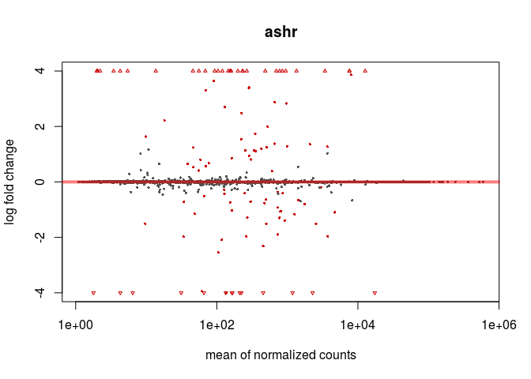

RNAcocktail\_analysis
================
German Novakovskiy
June 9, 2018

RNA-seq analysis with DESeq2
============================

``` r
suppressMessages(suppressWarnings(library(AnnotationDbi)))
suppressMessages(suppressWarnings(library(org.Hs.eg.db)))
suppressMessages(suppressWarnings(library(dplyr)))
suppressMessages(suppressWarnings(library(knitr)))
suppressMessages(suppressWarnings(library(tximport)))
suppressMessages(suppressWarnings(library(DESeq2)))
suppressMessages(suppressWarnings(library(edgeR)))
suppressMessages(suppressWarnings(library(tibble)))
suppressMessages(suppressWarnings(library(reshape2)))
suppressMessages(suppressWarnings(library(ggplot2)))
suppressMessages(suppressWarnings(library(RColorBrewer)))
suppressMessages(suppressWarnings(library(ermineR)))
suppressMessages(suppressWarnings(library(tidyverse)))
suppressMessages(suppressWarnings(library(tximport)))
suppressMessages(suppressWarnings(library(readr)))
suppressMessages(suppressWarnings(library(tximportData)))
suppressMessages(suppressWarnings(library(GenomicFeatures)))
suppressMessages(suppressWarnings(library(biomaRt)))
suppressMessages(suppressWarnings(library(gplots)))
suppressMessages(suppressWarnings(library(geneplotter)))
suppressMessages(suppressWarnings(library(fdrtool)))
suppressMessages(suppressWarnings(library(genefilter)))
suppressMessages(suppressWarnings(library(topGO)))
```

Running RNAcocktail with SALMON-SMEM
------------------------------------

Donwloading human transcriptome and gtf reference file (genome version 19):

``` bash
##downloading a transcriptome
#curl ftp://ftp.ensembl.org/pub/release-67/fasta/homo_sapiens/cdna/Homo_sapiens.GRCh37.67.cdna.all.fa.gz -o #human_transcriptome_19.fa.gz

##downloading gtf file 
#curl ftp://ftp.ensembl.org/pub/release-67/gtf/homo_sapiens/Homo_sapiens.GRCh37.67.gtf.gz -o genes_19.gtf.gz

##indexing a transcriptome
#salmon index -t human_transcriptome_19.fa -i human_transcriptome_19_index --type fmd
```

For running delete all comment symbols (\#) except the first line (I used version 67 from ensembl website; new version 92 is available).

``` bash
#!/bin/bash

#samples=($(ls raw_reads))

#for i in "${samples[@]}"
#do
        #TEST1=$(ls raw_reads/"$i"/*R1* | tr '\n' ' ' | \
        #awk '{for(i=1;i<=NF;i++){printf $i;if(i<NF)printf ","}}')

        #TEST2=$(ls raw_reads/"$i"/*R2* | tr '\n' ' ' | \
        #awk '{for(i=1;i<=NF;i++){printf $i;if(i<NF)printf ","}}')

        #run_rnacocktail.py quantify --quantifier_idx human_transcriptome_19_index/ --1 $TEST1 --2 $TEST2 \
        #--libtype ISR --salmon_k 19 --outdir salmon_out --workdir salmon_work --sample $i --unzip

        #echo '\n'
        #echo '\n'
        #echo "Done with $i"
        #echo '\n'
        #echo '\n'
#done
```

Analysis of quant data with DESeq2
----------------------------------

``` r
#metadata construction
samples <- c("Ctl1-1", "Ctl1-2", "Ctl2-1", "Ctl2-2", "VAN-011-1", "VAN-011-2",
             "VAN-012-1", "VAN-012-2", "VAN-013-1", "VAN-013-2", "VAN0092", "VAN3360091")
sex <- c("M", "M", "M", "M", "F", "F", "F", "F", "M", "M", "F", "F")
national <- c("Caucasian", "Caucasian", "Asian", "Asian",
              "Caucasian", "Caucasian", "Caucasian", "Caucasian",
              "Caucasian", "Caucasian", "Caucasian", "Caucasian")
relation <- c("NoFamily", "NoFamily", "NoFamily", "NoFamily",
              "Family", "Family", "Family", "Family",
              "Family", "Family", "Family", "Family")

#1 is affected, 0 if not
affected <- c(0, 0, 0, 0, 1, 1, 0, 0, 1, 1, 1, 1)
metadata <- data.frame(Samples = samples, National = national,
                       Relation = relation, Sex = sex, Affected = affected)
metadata$Affected <- as.factor(metadata$Affected)
rownames(metadata) <- samples
metadata
```

    ##               Samples  National Relation Sex Affected
    ## Ctl1-1         Ctl1-1 Caucasian NoFamily   M        0
    ## Ctl1-2         Ctl1-2 Caucasian NoFamily   M        0
    ## Ctl2-1         Ctl2-1     Asian NoFamily   M        0
    ## Ctl2-2         Ctl2-2     Asian NoFamily   M        0
    ## VAN-011-1   VAN-011-1 Caucasian   Family   F        1
    ## VAN-011-2   VAN-011-2 Caucasian   Family   F        1
    ## VAN-012-1   VAN-012-1 Caucasian   Family   F        0
    ## VAN-012-2   VAN-012-2 Caucasian   Family   F        0
    ## VAN-013-1   VAN-013-1 Caucasian   Family   M        1
    ## VAN-013-2   VAN-013-2 Caucasian   Family   M        1
    ## VAN0092       VAN0092 Caucasian   Family   F        1
    ## VAN3360091 VAN3360091 Caucasian   Family   F        1

``` r
#files, output from Salmon-SMEM
dir <- "~/RNA-seq_Cynthia/salmon_out"
files <- file.path(dir,"salmon_smem", metadata$Samples, "quant.sf")
files
```

    ##  [1] "~/RNA-seq_Cynthia/salmon_out/salmon_smem/Ctl1-1/quant.sf"    
    ##  [2] "~/RNA-seq_Cynthia/salmon_out/salmon_smem/Ctl1-2/quant.sf"    
    ##  [3] "~/RNA-seq_Cynthia/salmon_out/salmon_smem/Ctl2-1/quant.sf"    
    ##  [4] "~/RNA-seq_Cynthia/salmon_out/salmon_smem/Ctl2-2/quant.sf"    
    ##  [5] "~/RNA-seq_Cynthia/salmon_out/salmon_smem/VAN-011-1/quant.sf" 
    ##  [6] "~/RNA-seq_Cynthia/salmon_out/salmon_smem/VAN-011-2/quant.sf" 
    ##  [7] "~/RNA-seq_Cynthia/salmon_out/salmon_smem/VAN-012-1/quant.sf" 
    ##  [8] "~/RNA-seq_Cynthia/salmon_out/salmon_smem/VAN-012-2/quant.sf" 
    ##  [9] "~/RNA-seq_Cynthia/salmon_out/salmon_smem/VAN-013-1/quant.sf" 
    ## [10] "~/RNA-seq_Cynthia/salmon_out/salmon_smem/VAN-013-2/quant.sf" 
    ## [11] "~/RNA-seq_Cynthia/salmon_out/salmon_smem/VAN0092/quant.sf"   
    ## [12] "~/RNA-seq_Cynthia/salmon_out/salmon_smem/VAN3360091/quant.sf"

Using tximport package to load Salmon data:

``` r
names(files) <- metadata$Samples
TxDb <- makeTxDbFromGFF(file = "genes_19.gtf.gz")
```

    ## Import genomic features from the file as a GRanges object ... OK
    ## Prepare the 'metadata' data frame ... OK
    ## Make the TxDb object ...

    ## Warning in .get_cds_IDX(type, phase): The "phase" metadata column contains non-NA values for features of
    ##   type stop_codon. This information was ignored.

    ## OK

``` r
k <- keys(TxDb, keytype = "TXNAME")
tx2gene <- select(TxDb, k, "GENEID", "TXNAME")
```

    ## 'select()' returned 1:1 mapping between keys and columns

``` r
head(tx2gene)
```

    ##            TXNAME          GENEID
    ## 1 ENST00000456328 ENSG00000223972
    ## 2 ENST00000515242 ENSG00000223972
    ## 3 ENST00000518655 ENSG00000223972
    ## 4 ENST00000450305 ENSG00000223972
    ## 5 ENST00000473358 ENSG00000243485
    ## 6 ENST00000469289 ENSG00000243485

``` r
txi <- tximport(files, type = "salmon", tx2gene = tx2gene, ignoreTxVersion = TRUE)
```

    ## reading in files with read_tsv

    ## 1 2 3 4 5 6 7 8 9 10 11 12 
    ## summarizing abundance
    ## summarizing counts
    ## summarizing length

Let's construct a DESeqDataSet from the txi object and sample information in metadata:

``` r
ddsTxi <- DESeqDataSetFromTximport(txi,
                                   colData = metadata,
                                   design = ~ Sex + Affected)
```

    ## using counts and average transcript lengths from tximport

Pre-filtering
-------------

Filtering of low-expressed genes

``` r
keep <- rowSums(counts(ddsTxi)) >= 10
ddsTxi <- ddsTxi[keep,]
dim(counts(ddsTxi))
```

    ## [1] 21556    12

Collapsing technical replicates
-------------------------------

We have technical replicates for each individual:

``` r
ddsTxi$Samples <- factor(c("Ctl1", "Ctl1", "Ctl2", "Ctl2", "VAN-011", "VAN-011", "VAN-012", "VAN-012", "VAN-013", "VAN-013", "VAN0092", "VAN0092"))
ddsTxi$Run <- paste0("run",1:12)
colData(ddsTxi)
```

    ## DataFrame with 12 rows and 6 columns
    ##             Samples  National Relation      Sex Affected         Run
    ##            <factor>  <factor> <factor> <factor> <factor> <character>
    ## Ctl1-1         Ctl1 Caucasian NoFamily        M        0        run1
    ## Ctl1-2         Ctl1 Caucasian NoFamily        M        0        run2
    ## Ctl2-1         Ctl2     Asian NoFamily        M        0        run3
    ## Ctl2-2         Ctl2     Asian NoFamily        M        0        run4
    ## VAN-011-1   VAN-011 Caucasian   Family        F        1        run5
    ## ...             ...       ...      ...      ...      ...         ...
    ## VAN-012-2   VAN-012 Caucasian   Family        F        0        run8
    ## VAN-013-1   VAN-013 Caucasian   Family        M        1        run9
    ## VAN-013-2   VAN-013 Caucasian   Family        M        1       run10
    ## VAN0092     VAN0092 Caucasian   Family        F        1       run11
    ## VAN3360091  VAN0092 Caucasian   Family        F        1       run12

``` r
#sum up technical replicates
ddsTxi <- collapseReplicates(ddsTxi, ddsTxi$Samples, ddsTxi$Run)
colData(ddsTxi)
```

    ## DataFrame with 6 rows and 7 columns
    ##          Samples  National Relation      Sex Affected         Run
    ##         <factor>  <factor> <factor> <factor> <factor> <character>
    ## Ctl1        Ctl1 Caucasian NoFamily        M        0        run1
    ## Ctl2        Ctl2     Asian NoFamily        M        0        run3
    ## VAN0092  VAN0092 Caucasian   Family        F        1       run11
    ## VAN-011  VAN-011 Caucasian   Family        F        1        run5
    ## VAN-012  VAN-012 Caucasian   Family        F        0        run7
    ## VAN-013  VAN-013 Caucasian   Family        M        1        run9
    ##         runsCollapsed
    ##           <character>
    ## Ctl1        run1,run2
    ## Ctl2        run3,run4
    ## VAN0092   run11,run12
    ## VAN-011     run5,run6
    ## VAN-012     run7,run8
    ## VAN-013    run9,run10

Differential expression
-----------------------

``` r
#actual DE analysis
ddsTxi <- DESeq(ddsTxi)
```

    ## estimating size factors

    ## using 'avgTxLength' from assays(dds), correcting for library size

    ## estimating dispersions

    ## gene-wise dispersion estimates

    ## mean-dispersion relationship

    ## final dispersion estimates

    ## fitting model and testing

``` r
res <- results(ddsTxi, name="Affected_1_vs_0")
res
```

    ## log2 fold change (MLE): Affected 1 vs 0 
    ## Wald test p-value: Affected 1 vs 0 
    ## DataFrame with 21556 rows and 6 columns
    ##                    baseMean log2FoldChange     lfcSE        stat    pvalue
    ##                   <numeric>      <numeric> <numeric>   <numeric> <numeric>
    ## ENSG00000000003    2.614282     -0.1393123 2.1043097 -0.06620333 0.9472159
    ## ENSG00000000419 1541.902334     -0.1196105 0.2116908 -0.56502440 0.5720572
    ## ENSG00000000457  760.171992     -0.2295006 0.2160748 -1.06213487 0.2881745
    ## ENSG00000000460  905.000001     -0.0489697 0.2453854 -0.19956242 0.8418228
    ## ENSG00000000938 2511.248366     -0.7104193 0.5498190 -1.29209661 0.1963237
    ## ...                     ...            ...       ...         ...       ...
    ## ENSG00000263335   26.685662     0.77804413 0.9501666   0.8188502 0.4128719
    ## ENSG00000263340   20.309421     0.22479242 0.6526104   0.3444512 0.7305070
    ## ENSG00000263341    5.656033    -3.47417258 4.1415627  -0.8388555 0.4015504
    ## ENSG00000263344 7125.384971     0.04591577 0.1561821   0.2939888 0.7687665
    ## ENSG00000263345   23.761441     0.77179082 0.7219155   1.0690874 0.2850303
    ##                      padj
    ##                 <numeric>
    ## ENSG00000000003 0.9999121
    ## ENSG00000000419 0.9999121
    ## ENSG00000000457 0.9999121
    ## ENSG00000000460 0.9999121
    ## ENSG00000000938 0.9999121
    ## ...                   ...
    ## ENSG00000263335 0.9999121
    ## ENSG00000263340 0.9999121
    ## ENSG00000263341 0.9999121
    ## ENSG00000263344 0.9999121
    ## ENSG00000263345 0.9999121

Let's plot the densities of counts for the different samples.

``` r
multidensity( counts(ddsTxi, normalized = T),
              xlab="mean counts", xlim=c(0, 1000))
```


``` r
#adjusted p-value threshold
res05 <- results(ddsTxi, alpha=0.05)
summary(res05)
```

    ## 
    ## out of 21556 with nonzero total read count
    ## adjusted p-value < 0.05
    ## LFC > 0 (up)     : 59, 0.27% 
    ## LFC < 0 (down)   : 43, 0.2% 
    ## outliers [1]     : 0, 0% 
    ## low counts [2]   : 0, 0% 
    ## (mean count < 1)
    ## [1] see 'cooksCutoff' argument of ?results
    ## [2] see 'independentFiltering' argument of ?results

Only 59 genes are up-regulated, while 43 are down-regulated.

``` r
sum(res05$padj < 0.05, na.rm=TRUE)
```

    ## [1] 102

p–value histogram of “correctly” computed p–values will have a rectangular shape with a peak at 0.

Examine plot of p-values:

``` r
hist(res$pvalue, breaks=50, col="grey")
```

 We can see that this is clearly not the case for the p–values returned by DESeq2 in this case.

Very often, if the assumed variance of the null distribution is too high, we see hill–shaped p–value histogram. If the variance is too low, we get a U–shaped histogram, with peaks at both ends.

Here we have a hill–shape, indicating an overestimation of the variance in the null distribution. Thus, the N(0,1) null distribution of the Wald test (which was used by DESeq function) is not appropriate here.

Fortunately, there is software available to estimate the variance of the null–model from the test statistics. This is commonly referred to as “empirical null modelling”.

Here we use the fdrtool for this using the Wald statistic as input. This packages returns the estimated null variance, as well as estimates of various other FDR–related quantities and the p–values computed using the estimated null model parameters.

We first remove genes filtered out by independent filtering and the dispersion outliers, they have NA adj. pvals and NA p–values respectively.

``` r
res <- res[ !is.na(res$padj), ]

res <- res[ !is.na(res$pvalue), ]
```

We now remove the original adjusted p–values, since we will add the corrected ones later on.

``` r
res <- res[, -which(names(res) == "padj")]
```

We can now use z–scores returned by DESeq2as input to fdrtool to re–estimate the p–values.

``` r
FDR.res <- fdrtool(res$stat, statistic= "normal", plot = T)
```

    ## Step 1... determine cutoff point
    ## Step 2... estimate parameters of null distribution and eta0
    ## Step 3... compute p-values and estimate empirical PDF/CDF
    ## Step 4... compute q-values and local fdr
    ## Step 5... prepare for plotting


``` r
FDR.res$param[1, "sd"]
```

    ##        sd 
    ## 0.6727424

Interestingly the estimated null model variance is 0.6727424, which is lower than 1, the theoretical one.

We now add the new BH–adjusted p–values values to the results data frame.

``` r
res[,"padj"]  <- p.adjust(FDR.res$pval, method = "BH")
```

We can now plot the histogram of the “correct” p–values.

``` r
hist(FDR.res$pval, col = "royalblue4", 
     main = "Correct null model", xlab = "CORRECTED p-values")
```


Now everything is great. We have correct form of p-value distribution.

Let's check the number of DE genes now:

``` r
sum(res$padj < 0.05, na.rm=TRUE)
```

    ## [1] 406

We have 406 DE genes at fdr level 0.05.

Log fold change shrinkage for visualization and ranking
-------------------------------------------------------

Shrinkage of effect size (LFC estimates) is useful for visualization and ranking of genes. To shrink the LFC, we pass the dds object to the function lfcShrink. Below we specify to use the apeglm method for effect size shrinkage (Zhu, Ibrahim, and Love 2018), which improves on the previous estimator.

``` r
resultsNames(ddsTxi)
```

    ## [1] "Intercept"       "Sex_M_vs_F"      "Affected_1_vs_0"

``` r
resLFC <- lfcShrink(ddsTxi, coef="Affected_1_vs_0", type="apeglm")
```

    ## using 'apeglm' for LFC shrinkage

``` r
resLFC
```

    ## log2 fold change (MAP): Affected 1 vs 0 
    ## Wald test p-value: Affected 1 vs 0 
    ## DataFrame with 21556 rows and 5 columns
    ##                    baseMean log2FoldChange       lfcSE    pvalue      padj
    ##                   <numeric>      <numeric>   <numeric> <numeric> <numeric>
    ## ENSG00000000003    2.614282  -4.470158e-08 0.001608245 0.9472159 0.9999121
    ## ENSG00000000419 1541.902334  -3.828836e-06 0.001608205 0.5720572 0.9999121
    ## ENSG00000000457  760.171992  -7.308361e-06 0.001608215 0.2881745 0.9999121
    ## ENSG00000000460  905.000001  -1.594700e-06 0.001608213 0.8418228 0.9999121
    ## ENSG00000000938 2511.248366  -2.892116e-06 0.001608242 0.1963237 0.9999121
    ## ...                     ...            ...         ...       ...       ...
    ## ENSG00000263335   26.685662   6.431199e-07 0.001608244 0.4128719 0.9999121
    ## ENSG00000263340   20.309421   6.755381e-07 0.001608241 0.7305070 0.9999121
    ## ENSG00000263341    5.656033  -1.756836e-07 0.001608246 0.4015504 0.9999121
    ## ENSG00000263344 7125.384971   3.928961e-06 0.001608165 0.7687665 0.9999121
    ## ENSG00000263345   23.761441   2.757972e-06 0.001608244 0.2850303 0.9999121

MA plot
-------

The function plotMA shows the log2 fold changes attributable to a given variable over the mean of normalized counts for all the samples in the DESeqDataSet. Points will be colored red if the adjusted p value is less than 0.05 (for this threshold). Points which fall out of the window are plotted as open triangles pointing either up or down. (<https://support.bioconductor.org/p/93148/>)

``` r
plotMA(res, alpha = 0.05, ylim=c(-12,12))
```


It is more useful visualize the MA-plot for the shrunken log2 fold changes, which remove the noise associated with log2 fold changes from low count genes without requiring arbitrary filtering thresholds. (The large fold changes from genes with lots of statistical information are not shrunk, while the imprecise fold changes are shrunk).

``` r
plotMA(resLFC, ylim=c(-4,4), main = "apeglm")
```

 We probably see the plot like this, because nearly all genes have no change of expression and there is little to no variation across replicates (so near technical replication); the same pattern was found by limma. And we have small number of genes with very large fold changes (see the above plot).

We can do LFC shrinkage with different methods, but apeglm is considered to be better (I didn't go deep into this). For comparison shrinkage with other methods:

``` r
resLFCnormal <- lfcShrink(ddsTxi, coef="Affected_1_vs_0", type="normal")
plotMA(resLFCnormal, ylim=c(-4,4), main = "normal")
```


``` r
resLFCashr <- lfcShrink(ddsTxi, coef="Affected_1_vs_0", type="ashr")
```

    ## using 'ashr' for LFC shrinkage. If used in published research, please cite:
    ##     Stephens, M. (2016) False discovery rates: a new deal. Biostatistics, 18:2.
    ##     https://doi.org/10.1093/biostatistics/kxw041

    ## Due to absence of package REBayes, switching to EM algorithm

``` r
plotMA(resLFCashr, ylim=c(-4,4), main = "ashr")
```



Count plot of one gene with the lowest adjusted (multiple test correction) pvalue (remember, 0 is unaffected, 1 is affected):

``` r
plotCounts(ddsTxi, gene=which.min(res$padj), intgroup="Affected")
```

 (set returnData=TRUE for custom plots)

Some pictures
-------------

Let's visualize dispersion estimates (for each gene) of DESeq function:

``` r
plotDispEsts(ddsTxi, main="Dispersion plot")
```

 The black points are the dispersion estimates for each gene as obtained by considering the information from each gene separately. We have strong fluctuation of values around their true values, because we don't have enough samples here.

Therefore, the red trend line is fitted, which shows the dispersions’ dependence on the mean, and then shrink each gene’s estimate towards the red line to obtain the final estimates (blue points) that are then used in the hypothesis test.

The blue circles above the main “cloud” of points are genes which have high gene–wise dispersion estimates which are labelled as dispersion outliers. These estimates are therefore not shrunk toward the fitted trend line.

``` r
#Regularized log transformation for clustering/heatmaps, etc
#produces transformed data on the log2 scale which has been normalized with 
#respect to library size or other normalization factors.
rld <- rlogTransformation(ddsTxi)
head(assay(rld))
```

    ##                      Ctl1      Ctl2   VAN0092   VAN-011   VAN-012
    ## ENSG00000000003  1.312446  1.382763  1.283655  1.350900  1.300791
    ## ENSG00000000419 10.567924 10.810579 10.589912 10.477441 10.525904
    ## ENSG00000000457  9.702070  9.599486  9.321337  9.557868  9.638015
    ## ENSG00000000460  9.676775  9.967269  9.951230  9.796487  9.797046
    ## ENSG00000000938 12.159778 10.598002 10.795354 10.762131 11.194892
    ## ENSG00000001036 10.180975 10.266098 10.053624 10.050968 10.178690
    ##                   VAN-013
    ## ENSG00000000003  1.314253
    ## ENSG00000000419 10.522479
    ## ENSG00000000457  9.544236
    ## ENSG00000000460  9.687536
    ## ENSG00000000938 11.053404
    ## ENSG00000001036 10.038137

``` r
hist(assay(rld))
```


``` r
condition <- factor(c(0, 0, 1, 0, 1, 1))
mycols <- brewer.pal(8, "Dark2")[1:length(unique(condition))]

# Sample distance heatmap
sampleDists <- as.matrix(dist(t(assay(rld))))
heatmap.2(as.matrix(sampleDists), key=F, trace="none",
          col=colorpanel(100, "black", "white"),
          ColSideColors=mycols[condition], RowSideColors=mycols[condition],
          margin=c(10, 10), main="Sample Distance Matrix")
legend(0.9,0.9, legend = unique(condition), col = c("#1B9E77", "#D95F02"), pch = 19)
```

 PCA plot:

``` r
plotPCA(rld, intgroup=c("Affected"))
```


Write results to file
---------------------

order by adjusted pvalue

``` r
resOrdered <- res[order(res$padj),]
results <- as.data.frame(resOrdered)
results <- results %>% rownames_to_column("ensgene") %>% filter(padj < 0.05)

ensembl = useEnsembl(biomart="ensembl", dataset="hsapiens_gene_ensembl")
hgnc_genes <- getBM(attributes=c('ensembl_gene_id','gene_biotype','hgnc_symbol','chromosome_name','description'), filters = 'ensembl_gene_id', values = results$ensgene, mart = ensembl)

head(hgnc_genes)
```

    ##   ensembl_gene_id   gene_biotype hgnc_symbol chromosome_name
    ## 1 ENSG00000007038 protein_coding      PRSS21              16
    ## 2 ENSG00000008517 protein_coding        IL32              16
    ## 3 ENSG00000021300 protein_coding     PLEKHB1              11
    ## 4 ENSG00000043514 protein_coding       TRIT1               1
    ## 5 ENSG00000059804 protein_coding      SLC2A3              12
    ## 6 ENSG00000060709 protein_coding      RIMBP2              12
    ##                                                                    description
    ## 1                        serine protease 21 [Source:HGNC Symbol;Acc:HGNC:9485]
    ## 2                           interleukin 32 [Source:HGNC Symbol;Acc:HGNC:16830]
    ## 3 pleckstrin homology domain containing B1 [Source:HGNC Symbol;Acc:HGNC:19079]
    ## 4            tRNA isopentenyltransferase 1 [Source:HGNC Symbol;Acc:HGNC:20286]
    ## 5         solute carrier family 2 member 3 [Source:HGNC Symbol;Acc:HGNC:11007]
    ## 6                   RIMS binding protein 2 [Source:HGNC Symbol;Acc:HGNC:30339]

``` r
#ensembl genes that are not present in mart for some reason (probably because of the old ensembl annotation file, which I used)
results %>% filter(!ensgene %in% hgnc_genes$ensembl_gene_id)
```

    ##            ensgene    baseMean log2FoldChange     lfcSE      stat
    ## 1  ENSG00000108278  166.267737     -8.6988517 1.1242443 -7.737510
    ## 2  ENSG00000182109  118.519417     -2.1657372 0.3397979 -6.373603
    ## 3  ENSG00000188126  662.048752      3.0361734 0.5002665  6.069112
    ## 4  ENSG00000257073  104.268712      8.4182182 1.3210579  6.372331
    ## 5  ENSG00000261493  985.729850      1.3139377 0.2323920  5.653972
    ## 6  ENSG00000262170  454.491363     -5.3185571 0.5708573 -9.316789
    ## 7  ENSG00000230195    1.786816    -19.6438225 4.2056741 -4.670790
    ## 8  ENSG00000263230    4.264445     17.2349526 4.2015298  4.102066
    ## 9  ENSG00000262279    2.046934     16.7349638 4.2045305  3.980222
    ## 10 ENSG00000262023  301.899973      2.0194506 0.5426790  3.721261
    ## 11 ENSG00000262197    9.671020     -5.9248167 1.6426938 -3.606769
    ## 12 ENSG00000263062  250.243564     -1.4949885 0.4230029 -3.534228
    ## 13 ENSG00000262397   70.170491      2.2346867 0.6340612  3.524402
    ## 14 ENSG00000140181 2982.191432     -0.9500317 0.2746887 -3.458576
    ## 15 ENSG00000203827  257.590478      1.1807384 0.3617654  3.263824
    ## 16 ENSG00000206082  299.998124     -0.7255864 0.2326985 -3.118140
    ## 17 ENSG00000179296  136.512736      2.1409299 0.6876629  3.113342
    ## 18 ENSG00000262511  638.882093      0.9588027 0.3125650  3.067531
    ## 19 ENSG00000205595    6.046182     -6.1449119 2.0236562 -3.036539
    ## 20 ENSG00000262641   17.733641     -7.5052760 2.6843312 -2.795958
    ## 21 ENSG00000185128  958.307795      2.1044884 0.7569883  2.780080
    ## 22 ENSG00000184674  316.248567     -5.5040136 2.0205504 -2.724017
    ## 23 ENSG00000261657  176.214142      0.7508367 0.2771524  2.709112
    ## 24 ENSG00000232745   21.336090     -3.2504059 1.2024780 -2.703090
    ## 25 ENSG00000262122  746.627110     -1.3517584 0.5023904 -2.690653
    ## 26 ENSG00000261948  155.876450     -1.5882979 0.5911551 -2.686770
    ## 27 ENSG00000234516   25.582783      3.4912836 1.3116507  2.661748
    ## 28 ENSG00000235231   42.504792     -3.2393882 1.2251262 -2.644126
    ## 29 ENSG00000261969   15.042716     -7.2608042 2.7528041 -2.637603
    ## 30 ENSG00000262137   15.042716     -7.2608042 2.7528041 -2.637603
    ## 31 ENSG00000262357   15.042716     -7.2608042 2.7528041 -2.637603
    ## 32 ENSG00000262857   15.042716     -7.2608042 2.7528041 -2.637603
    ## 33 ENSG00000262954   15.042716     -7.2608042 2.7528041 -2.637603
    ## 34 ENSG00000263268   15.042716     -7.2608042 2.7528041 -2.637603
    ## 35 ENSG00000072444   15.533054     -4.4031027 1.6812174 -2.618997
    ## 36 ENSG00000263054 2309.073740      6.1169870 2.3561883  2.596137
    ## 37 ENSG00000260952  867.781809      1.0179728 0.4125851  2.467304
    ## 38 ENSG00000197704    4.294400     -5.5461409 2.2639376 -2.449776
    ## 39 ENSG00000255436   76.639888      2.0958183 0.8773164  2.388897
    ## 40 ENSG00000262741   79.394960      2.9980443 1.2971087  2.311329
    ## 41 ENSG00000172070  437.402311     -0.6745783 0.3019365 -2.234172
    ## 42 ENSG00000259938  283.900655     -1.3437647 0.6039285 -2.225039
    ##          pvalue         padj
    ## 1  1.013824e-14 1.087817e-13
    ## 2  1.846381e-10 1.087817e-13
    ## 3  1.286193e-09 1.087817e-13
    ## 4  1.861767e-10 1.087817e-13
    ## 5  1.567821e-08 1.087817e-13
    ## 6  1.199149e-20 1.087817e-13
    ## 7  3.000428e-06 1.452544e-09
    ## 8  4.094775e-05 2.976959e-07
    ## 9  6.885101e-05 8.247382e-07
    ## 10 1.982301e-04 6.777095e-06
    ## 11 3.100337e-04 1.643050e-05
    ## 12 4.089682e-04 2.822413e-05
    ## 13 4.244395e-04 3.028576e-05
    ## 14 5.430382e-04 4.868147e-05
    ## 15 1.099196e-03 1.970900e-04
    ## 16 1.819963e-03 5.029605e-04
    ## 17 1.849814e-03 5.172101e-04
    ## 18 2.158351e-03 6.773181e-04
    ## 19 2.393108e-03 8.078970e-04
    ## 20 5.174620e-03 3.323557e-03
    ## 21 5.434543e-03 3.615186e-03
    ## 22 6.449320e-03 4.903496e-03
    ## 23 6.746365e-03 5.249711e-03
    ## 24 6.869819e-03 5.383510e-03
    ## 25 7.131223e-03 5.653403e-03
    ## 26 7.214658e-03 5.721954e-03
    ## 27 7.773608e-03 6.478361e-03
    ## 28 8.190213e-03 7.004907e-03
    ## 29 8.349428e-03 7.037506e-03
    ## 30 8.349428e-03 7.037506e-03
    ## 31 8.349428e-03 7.037506e-03
    ## 32 8.349428e-03 7.037506e-03
    ## 33 8.349428e-03 7.037506e-03
    ## 34 8.349428e-03 7.037506e-03
    ## 35 8.818880e-03 7.732488e-03
    ## 36 9.427853e-03 8.701542e-03
    ## 37 1.361347e-02 1.714003e-02
    ## 38 1.429449e-02 1.843327e-02
    ## 39 1.689905e-02 2.476971e-02
    ## 40 2.081472e-02 3.387757e-02
    ## 41 2.547173e-02 4.845936e-02
    ## 42 2.607860e-02 4.999331e-02

``` r
write.csv(as.data.frame(results), file="~/RNA-seq_Cynthia/pipeline_1.csv")

results_present <- results %>% filter(ensgene %in% hgnc_genes$ensembl_gene_id)

colnames(hgnc_genes)[1] <- "ensgene"
x <- hgnc_genes %>% dplyr::select(ensgene, hgnc_symbol)
results_joined <- left_join(results_present, x)
```

    ## Joining, by = "ensgene"

``` r
write.csv(as.data.frame(results_joined), file="~/RNA-seq_Cynthia/pipeline_1_hgnc.csv")
```

In limma we found only 21 DE genes. Among them 17 are present here: OASL, LRRC32, MEGF9, GSTM1, CYP4F29P, CPNE1, APOBEC3B, CD151, ZNF232, CXCR4, CHI3L2, DGKQ, ZNF215, PRKACB, CNTNAP1, SPARC, TRIT1.

Gene ontology enrichment analysis
---------------------------------

``` r
#406 DE genes which we saved to pipeline_1.csv
sigGenes <- rownames(subset(res, padj < 0.05))

anno <- AnnotationDbi::select(org.Hs.eg.db, 
               keys=rownames(res), 
              columns=c("SYMBOL","SYMBOL", "GENENAME"),
              keytype="ENSEMBL")
```

    ## 'select()' returned 1:many mapping between keys and columns

``` r
#using another annotation here, but almost the same as biomart
anSig <- as.data.frame(subset(anno, ENSEMBL %in% sigGenes))

head(anSig)
```

    ##             ENSEMBL  SYMBOL                                 GENENAME
    ## 144 ENSG00000007038  PRSS21                      protease, serine 21
    ## 197 ENSG00000008517    IL32                           interleukin 32
    ## 357 ENSG00000021300 PLEKHB1 pleckstrin homology domain containing B1
    ## 528 ENSG00000043514   TRIT1            tRNA isopentenyltransferase 1
    ## 722 ENSG00000059804  SLC2A3         solute carrier family 2 member 3
    ## 734 ENSG00000060709  RIMBP2                   RIMS binding protein 2

We first get average gene expressions for each of the genes and then find non–DE genes that show a similar expression as the DE–genes. These genes are then our background (for gene set enrichment analysis).

``` r
overallBaseMean <- as.matrix(res[, "baseMean", drop = F])

sig_idx <- match(anSig$ENSEMBL, rownames(overallBaseMean))
backG <- c()

for(i in sig_idx){
  ind <- genefinder(overallBaseMean, i, 10, method = "manhattan")[[1]]$indices
  backG <- c(backG, ind)

}

backG <- unique(backG)
backG <- rownames(overallBaseMean)[backG]
```

We now remove DE genes from background and the get the total number of genes in the background.

``` r
backG <- setdiff(backG,  anSig$ENSEMBL)
length(backG)
```

    ## [1] 3095

Plotting the density of the average expressions:

``` r
multidensity( list( 
       all= log2(res[,"baseMean"]) ,
       foreground =log2(res[anSig$ENSEMBL, "baseMean"]), 
       background =log2(res[backG, "baseMean"])), 
     xlab="log2 mean normalized counts", main = "Matching for enrichment analysis")
```


Now let's try topGO.

We first create a factor alg which indicates for every gene in our universe (union of background and DE-genes), whether it is differentially expressed or not. It has the ENSEMBL ID’s of the genes in our universe as names and contains 1 if the gene is DE and 0 otherwise.

``` r
onts = c( "MF", "BP", "CC" )

geneIDs = rownames(overallBaseMean)
inUniverse = geneIDs %in% c(anSig$ENSEMBL,  backG) 
inSelection =  geneIDs %in% anSig$ENSEMBL 
alg <- factor( as.integer( inSelection[inUniverse] ) )
names(alg) <- geneIDs[inUniverse]
```

Here we run two common tests: an ordinary Fisher test for every GO category, and the “elim” algorithm, which tries to incorporate the hierarchical structure of the GO and to “decorrelate” it.

``` r
#prepare the data
tgd <- new("topGOdata", ontology="BP", allGenes = alg, nodeSize=5,
                 annot=annFUN.org, mapping="org.Hs.eg.db", ID = "ensembl" )
```

    ## 
    ## Building most specific GOs .....

    ##  ( 5025 GO terms found. )

    ## 
    ## Build GO DAG topology ..........

    ##  ( 9084 GO terms and 20789 relations. )

    ## 
    ## Annotating nodes ...............

    ##  ( 2348 genes annotated to the GO terms. )

``` r
#run tests
resultTopGO.elim <- runTest(tgd, algorithm = "elim", statistic = "Fisher" )
```

    ## 
    ##           -- Elim Algorithm -- 
    ## 
    ##       the algorithm is scoring 2668 nontrivial nodes
    ##       parameters: 
    ##           test statistic: fisher
    ##           cutOff: 0.01

    ## 
    ##   Level 16:  3 nodes to be scored    (0 eliminated genes)

    ## 
    ##   Level 15:  11 nodes to be scored   (9 eliminated genes)

    ## 
    ##   Level 14:  24 nodes to be scored   (21 eliminated genes)

    ## 
    ##   Level 13:  46 nodes to be scored   (22 eliminated genes)

    ## 
    ##   Level 12:  83 nodes to be scored   (77 eliminated genes)

    ## 
    ##   Level 11:  146 nodes to be scored  (113 eliminated genes)

    ## 
    ##   Level 10:  226 nodes to be scored  (194 eliminated genes)

    ## 
    ##   Level 9:   304 nodes to be scored  (234 eliminated genes)

    ## 
    ##   Level 8:   367 nodes to be scored  (334 eliminated genes)

    ## 
    ##   Level 7:   436 nodes to be scored  (433 eliminated genes)

    ## 
    ##   Level 6:   419 nodes to be scored  (460 eliminated genes)

    ## 
    ##   Level 5:   323 nodes to be scored  (546 eliminated genes)

    ## 
    ##   Level 4:   176 nodes to be scored  (608 eliminated genes)

    ## 
    ##   Level 3:   84 nodes to be scored   (711 eliminated genes)

    ## 
    ##   Level 2:   19 nodes to be scored   (750 eliminated genes)

    ## 
    ##   Level 1:   1 nodes to be scored    (750 eliminated genes)

``` r
resultTopGO.classic <- runTest(tgd, algorithm = "classic", statistic = "Fisher" )
```

    ## 
    ##           -- Classic Algorithm -- 
    ## 
    ##       the algorithm is scoring 2668 nontrivial nodes
    ##       parameters: 
    ##           test statistic: fisher

``` r
#results
GO_result_table <- GenTable( tgd, Fisher.elim = resultTopGO.elim, Fisher.classic = resultTopGO.classic, 
                          orderBy = "Fisher.classic" , topNodes = 200)
```

Best Fisher elim results:

``` r
elim_res <- GO_result_table %>%
  dplyr::filter(Fisher.elim < 0.05) %>%
  dplyr::select(Term, Fisher.elim)

elim_res
```

    ##                                           Term Fisher.elim
    ## 1        cellular response to interferon-gamma     0.00622
    ## 2                regulation of immune response     0.00424
    ## 3                 leukocyte cell-cell adhesion     0.04938
    ## 4                           cell-cell adhesion     0.00268
    ## 5                         leukocyte activation     0.00095
    ## 6  immune response-activating cell surface ...     0.00341
    ## 7  positive regulation of cytokine-mediated...     0.00190
    ## 8  natural killer cell mediated cytotoxicit...     0.00041
    ## 9  negative regulation of protein ubiquitin...     0.00129
    ## 10 regulation of transcription from RNA pol...     0.00940
    ## 11 negative regulation of cell proliferatio...     0.00013
    ## 12     adiponectin-activated signaling pathway     0.00014
    ## 13 ER-associated misfolded protein cataboli...     0.00018
    ## 14 positive regulation of nucleotide-bindin...     0.00018
    ## 15 negative regulation of inclusion body as...     0.00018
    ## 16 negative regulation of extrinsic apoptot...     0.00018
    ## 17 regulation of proteasomal ubiquitin-depe...     0.01348
    ## 18      regulation of mitotic spindle assembly     0.00041
    ## 19 negative regulation of viral release fro...     0.00043
    ## 20       cellular response to hormone stimulus     0.01461
    ## 21                     humoral immune response     0.01479

``` r
write.csv(GO_result_table, file = "~/RNA-seq_Cynthia/topGOResults.csv")
```
