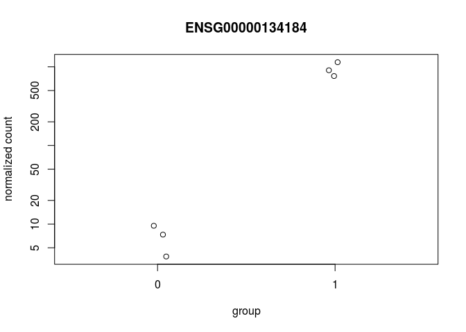
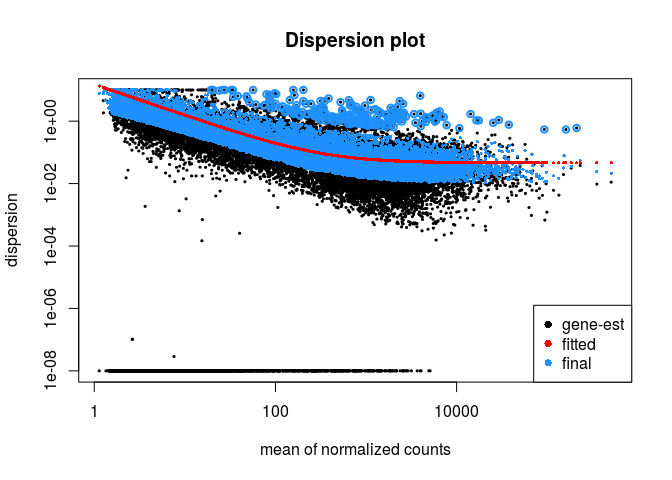

RNAcocktail\_pipeline\_quality
================
German Novakovskiy
June 11, 2018

RNA-seq analysis with DESeq2
============================

``` r
suppressMessages(suppressWarnings(library(AnnotationDbi)))
suppressMessages(suppressWarnings(library(org.Hs.eg.db)))
suppressMessages(suppressWarnings(library(dplyr)))
suppressMessages(suppressWarnings(library(knitr)))
suppressMessages(suppressWarnings(library(tximport)))
suppressMessages(suppressWarnings(library(DESeq2)))
suppressMessages(suppressWarnings(library(edgeR)))
suppressMessages(suppressWarnings(library(tibble)))
suppressMessages(suppressWarnings(library(reshape2)))
suppressMessages(suppressWarnings(library(ggplot2)))
suppressMessages(suppressWarnings(library(RColorBrewer)))
suppressMessages(suppressWarnings(library(ermineR)))
suppressMessages(suppressWarnings(library(tidyverse)))
suppressMessages(suppressWarnings(library(tximport)))
suppressMessages(suppressWarnings(library(readr)))
suppressMessages(suppressWarnings(library(tximportData)))
suppressMessages(suppressWarnings(library(GenomicFeatures)))
suppressMessages(suppressWarnings(library(biomaRt)))
suppressMessages(suppressWarnings(library(gplots)))
suppressMessages(suppressWarnings(library(geneplotter)))
suppressMessages(suppressWarnings(library(fdrtool)))
suppressMessages(suppressWarnings(library(genefilter)))
suppressMessages(suppressWarnings(library(topGO)))
```

Running RNAcocktail with SALMON-SMEM
------------------------------------

Quality control with AfterQC and BBduk (from BBMap package) tools (quality\_control.sh) (Remove all \# for running, except first line):

``` bash
#!/bin/bash

##folder with raw reads
#samples=($(ls raw_reads))

#for i in "${samples[@]}"
#do
        ##running AfterQC
        #python ../AfterQC-master/after.py -d raw_reads/$i -g good/$i -b bad/$i -r QC/$i
        #rm -rf bad
        #rm -rf QC
        #cd good/$i
        #for j in `ls -1 *_R1_001.good.fq.gz | sed 's/_R1_001.good.fq.gz//'`
        #do
                ##adapter trimming with bbduk tool
                #../../../bbmap/bbduk.sh -Xmx1g in1=$j\_R1_001.good.fq.gz in2=$j\_R2_001.good.fq.gz out1=$j\_clean_R1.fq out2=$j\_clean_R2.fq ref=../../../bbmap/resources/adapters.fa ktrim=l k=23 mink=11 hdist=1 minlength=35 tpe tbo
                
                ##deleting to save space
                #rm $j\_R1_001.good.fq.gz
                #rm $j\_R2_001.good.fq.gz
        #done
        #cd ../../
        #echo " "
        #echo " "
        #echo "Done with $i"
        #echo " "
        #echo " "
#done
```

Donwloading human transcriptome and gtf reference file (genome version 19):

``` bash
##downloading transcriptome
#curl ftp://ftp.ensembl.org/pub/grch37/release-92/fasta/homo_sapiens/cdna/Homo_sapiens.GRCh37.cdna.all.fa.gz -o #human_92_transcriptome_19.fa.gz

##downloading gtf annotation
#curl ftp://ftp.ensembl.org/pub/grch37/release-92/gtf/homo_sapiens/Homo_sapiens.GRCh37.87.gtf.gz -o genes_92_19.gtf.gz


##indexing a transcriptome
#salmon index -t human_transcriptome_19.fa -i human_transcriptome_19_index --type fmd
```

For running delete all comment symbols (\#) except the first line (I used version 67 from ensembl website; new version 92 is available) (run\_salmon.sh script):

``` bash
#!/bin/bash

#samples=($(ls good_reads))

#for i in "${samples[@]}"
#do
        #TEST1=$(ls good_reads/"$i"/*R1* | tr '\n' ' ' | \
        #awk '{for(i=1;i<=NF;i++){printf $i;if(i<NF)printf ","}}')

        #TEST2=$(ls good_reads/"$i"/*R2* | tr '\n' ' ' | \
        #awk '{for(i=1;i<=NF;i++){printf $i;if(i<NF)printf ","}}')

        #run_rnacocktail.py quantify --quantifier_idx human_transcriptome_92_19_index/ --1 $TEST1 --2 $TEST2 \
        #--libtype ISR --salmon_k 19 --outdir salmon_clean_out --workdir salmon_clean_work --sample $i --unzip

        #echo '\n'
        #echo '\n'
        #echo "Done with $i"
        #echo '\n'
        #echo '\n'
#done
```

Analysis of quant data with DESeq2
----------------------------------

``` r
#metadata construction
samples <- c("Ctl1-1", "Ctl1-2", "Ctl2-1", "Ctl2-2", "VAN-011-1", "VAN-011-2",
             "VAN-012-1", "VAN-012-2", "VAN-013-1", "VAN-013-2", "VAN0092", "VAN3360091")
sex <- c("M", "M", "M", "M", "F", "F", "F", "F", "M", "M", "F", "F")
national <- c("Caucasian", "Caucasian", "Asian", "Asian",
              "Caucasian", "Caucasian", "Caucasian", "Caucasian",
              "Caucasian", "Caucasian", "Caucasian", "Caucasian")
relation <- c("NoFamily", "NoFamily", "NoFamily", "NoFamily",
              "Family", "Family", "Family", "Family",
              "Family", "Family", "Family", "Family")

#1 is affected, 0 if not
affected <- c(0, 0, 0, 0, 1, 1, 0, 0, 1, 1, 1, 1)
metadata <- data.frame(Samples = samples, National = national,
                       Relation = relation, Sex = sex, Affected = affected)
metadata$Affected <- as.factor(metadata$Affected)
rownames(metadata) <- samples
metadata
```

    ##               Samples  National Relation Sex Affected
    ## Ctl1-1         Ctl1-1 Caucasian NoFamily   M        0
    ## Ctl1-2         Ctl1-2 Caucasian NoFamily   M        0
    ## Ctl2-1         Ctl2-1     Asian NoFamily   M        0
    ## Ctl2-2         Ctl2-2     Asian NoFamily   M        0
    ## VAN-011-1   VAN-011-1 Caucasian   Family   F        1
    ## VAN-011-2   VAN-011-2 Caucasian   Family   F        1
    ## VAN-012-1   VAN-012-1 Caucasian   Family   F        0
    ## VAN-012-2   VAN-012-2 Caucasian   Family   F        0
    ## VAN-013-1   VAN-013-1 Caucasian   Family   M        1
    ## VAN-013-2   VAN-013-2 Caucasian   Family   M        1
    ## VAN0092       VAN0092 Caucasian   Family   F        1
    ## VAN3360091 VAN3360091 Caucasian   Family   F        1

``` r
#files, output from Salmon-SMEM
dir <- "~/RNA-seq_Cynthia/salmon_clean_out"
files <- file.path(dir,"salmon_smem", metadata$Samples, "quant.sf")
files
```

    ##  [1] "~/RNA-seq_Cynthia/salmon_clean_out/salmon_smem/Ctl1-1/quant.sf"    
    ##  [2] "~/RNA-seq_Cynthia/salmon_clean_out/salmon_smem/Ctl1-2/quant.sf"    
    ##  [3] "~/RNA-seq_Cynthia/salmon_clean_out/salmon_smem/Ctl2-1/quant.sf"    
    ##  [4] "~/RNA-seq_Cynthia/salmon_clean_out/salmon_smem/Ctl2-2/quant.sf"    
    ##  [5] "~/RNA-seq_Cynthia/salmon_clean_out/salmon_smem/VAN-011-1/quant.sf" 
    ##  [6] "~/RNA-seq_Cynthia/salmon_clean_out/salmon_smem/VAN-011-2/quant.sf" 
    ##  [7] "~/RNA-seq_Cynthia/salmon_clean_out/salmon_smem/VAN-012-1/quant.sf" 
    ##  [8] "~/RNA-seq_Cynthia/salmon_clean_out/salmon_smem/VAN-012-2/quant.sf" 
    ##  [9] "~/RNA-seq_Cynthia/salmon_clean_out/salmon_smem/VAN-013-1/quant.sf" 
    ## [10] "~/RNA-seq_Cynthia/salmon_clean_out/salmon_smem/VAN-013-2/quant.sf" 
    ## [11] "~/RNA-seq_Cynthia/salmon_clean_out/salmon_smem/VAN0092/quant.sf"   
    ## [12] "~/RNA-seq_Cynthia/salmon_clean_out/salmon_smem/VAN3360091/quant.sf"

Using tximport package to load Salmon data:

``` r
names(files) <- metadata$Samples
TxDb <- makeTxDbFromGFF(file = "genes_92_19.gtf.gz")
```

    ## Import genomic features from the file as a GRanges object ... OK
    ## Prepare the 'metadata' data frame ... OK
    ## Make the TxDb object ...

    ## Warning in .get_cds_IDX(type, phase): The "phase" metadata column contains non-NA values for features of
    ##   type stop_codon. This information was ignored.

    ## OK

``` r
k <- keys(TxDb, keytype = "TXNAME")
tx2gene <- select(TxDb, k, "GENEID", "TXNAME")
```

    ## 'select()' returned 1:1 mapping between keys and columns

``` r
head(tx2gene)
```

    ##            TXNAME          GENEID
    ## 1 ENST00000456328 ENSG00000223972
    ## 2 ENST00000515242 ENSG00000223972
    ## 3 ENST00000518655 ENSG00000223972
    ## 4 ENST00000450305 ENSG00000223972
    ## 5 ENST00000473358 ENSG00000243485
    ## 6 ENST00000469289 ENSG00000243485

``` r
txi <- tximport(files, type = "salmon", tx2gene = tx2gene, ignoreTxVersion = TRUE)
```

    ## reading in files with read_tsv

    ## 1 2 3 4 5 6 7 8 9 10 11 12 
    ## transcripts missing from tx2gene: 16723
    ## summarizing abundance
    ## summarizing counts
    ## summarizing length

Let's construct a DESeqDataSet from the txi object and sample information in metadata:

``` r
ddsTxi <- DESeqDataSetFromTximport(txi,
                                   colData = metadata,
                                   design = ~ Sex + Affected)
```

    ## using counts and average transcript lengths from tximport

Pre-filtering
-------------

Filtering of low-expressed genes

``` r
keep <- rowSums(counts(ddsTxi)) >= 10
ddsTxi <- ddsTxi[keep,]
dim(counts(ddsTxi))
```

    ## [1] 18497    12

Collapsing technical replicates
-------------------------------

We have technical replicates for each individual:

``` r
ddsTxi$Samples <- factor(c("Ctl1", "Ctl1", "Ctl2", "Ctl2", "VAN-011", "VAN-011", "VAN-012", "VAN-012", "VAN-013", "VAN-013", "VAN0092", "VAN0092"))
ddsTxi$Run <- paste0("run",1:12)
colData(ddsTxi)
```

    ## DataFrame with 12 rows and 6 columns
    ##             Samples  National Relation      Sex Affected         Run
    ##            <factor>  <factor> <factor> <factor> <factor> <character>
    ## Ctl1-1         Ctl1 Caucasian NoFamily        M        0        run1
    ## Ctl1-2         Ctl1 Caucasian NoFamily        M        0        run2
    ## Ctl2-1         Ctl2     Asian NoFamily        M        0        run3
    ## Ctl2-2         Ctl2     Asian NoFamily        M        0        run4
    ## VAN-011-1   VAN-011 Caucasian   Family        F        1        run5
    ## ...             ...       ...      ...      ...      ...         ...
    ## VAN-012-2   VAN-012 Caucasian   Family        F        0        run8
    ## VAN-013-1   VAN-013 Caucasian   Family        M        1        run9
    ## VAN-013-2   VAN-013 Caucasian   Family        M        1       run10
    ## VAN0092     VAN0092 Caucasian   Family        F        1       run11
    ## VAN3360091  VAN0092 Caucasian   Family        F        1       run12

``` r
#sum up technical replicates
ddsTxi <- collapseReplicates(ddsTxi, ddsTxi$Samples, ddsTxi$Run)
colData(ddsTxi)
```

    ## DataFrame with 6 rows and 7 columns
    ##          Samples  National Relation      Sex Affected         Run
    ##         <factor>  <factor> <factor> <factor> <factor> <character>
    ## Ctl1        Ctl1 Caucasian NoFamily        M        0        run1
    ## Ctl2        Ctl2     Asian NoFamily        M        0        run3
    ## VAN0092  VAN0092 Caucasian   Family        F        1       run11
    ## VAN-011  VAN-011 Caucasian   Family        F        1        run5
    ## VAN-012  VAN-012 Caucasian   Family        F        0        run7
    ## VAN-013  VAN-013 Caucasian   Family        M        1        run9
    ##         runsCollapsed
    ##           <character>
    ## Ctl1        run1,run2
    ## Ctl2        run3,run4
    ## VAN0092   run11,run12
    ## VAN-011     run5,run6
    ## VAN-012     run7,run8
    ## VAN-013    run9,run10

Differential expression
-----------------------

``` r
#actual DE analysis
ddsTxi <- DESeq(ddsTxi)
```

    ## estimating size factors

    ## using 'avgTxLength' from assays(dds), correcting for library size

    ## estimating dispersions

    ## gene-wise dispersion estimates

    ## mean-dispersion relationship

    ## final dispersion estimates

    ## fitting model and testing

``` r
res <- results(ddsTxi, name="Affected_1_vs_0")
res
```

    ## log2 fold change (MLE): Affected 1 vs 0 
    ## Wald test p-value: Affected 1 vs 0 
    ## DataFrame with 18497 rows and 6 columns
    ##                    baseMean log2FoldChange     lfcSE         stat
    ##                   <numeric>      <numeric> <numeric>    <numeric>
    ## ENSG00000000003    1.800571   -0.007956617 2.2433328 -0.003546784
    ## ENSG00000000419 1478.664215   -0.101692150 0.2140603 -0.475063054
    ## ENSG00000000457  875.158898   -0.206695574 0.2164895 -0.954760171
    ## ENSG00000000460  878.001973   -0.030955525 0.2478193 -0.124911696
    ## ENSG00000000938 2439.308266   -0.709592271 0.5469561 -1.297347829
    ## ...                     ...            ...       ...          ...
    ## ENSG00000273294   23.498833     -0.5850800 1.5407387   -0.3797399
    ## ENSG00000273327    5.236292     -1.9638367 1.6422839   -1.1957961
    ## ENSG00000273340    5.616897     -3.3649950 2.2682297   -1.4835336
    ## ENSG00000273398    6.349147      3.6654086 2.7488319    1.3334423
    ## ENSG00000273439   33.504120     -0.2402424 0.5825094   -0.4124266
    ##                    pvalue      padj
    ##                 <numeric> <numeric>
    ## ENSG00000000003 0.9971701 0.9998494
    ## ENSG00000000419 0.6347420 0.9998494
    ## ENSG00000000457 0.3396990 0.9998494
    ## ENSG00000000460 0.9005935 0.9998494
    ## ENSG00000000938 0.1945115 0.9998494
    ## ...                   ...       ...
    ## ENSG00000273294 0.7041385 0.9998494
    ## ENSG00000273327 0.2317761 0.9998494
    ## ENSG00000273340 0.1379327 0.9998494
    ## ENSG00000273398 0.1823867 0.9998494
    ## ENSG00000273439 0.6800267 0.9998494

Let's plot the densities of counts for the different samples.

``` r
multidensity( counts(ddsTxi, normalized = T),
              xlab="mean counts", xlim=c(0, 1000))
```


``` r
#adjusted p-value threshold
res05 <- results(ddsTxi, alpha=0.05)
summary(res05)
```

    ## 
    ## out of 18497 with nonzero total read count
    ## adjusted p-value < 0.05
    ## LFC > 0 (up)     : 15, 0.081% 
    ## LFC < 0 (down)   : 17, 0.092% 
    ## outliers [1]     : 0, 0% 
    ## low counts [2]   : 0, 0% 
    ## (mean count < 1)
    ## [1] see 'cooksCutoff' argument of ?results
    ## [2] see 'independentFiltering' argument of ?results

``` r
sum(res05$padj < 0.05, na.rm=TRUE)
```

    ## [1] 32

p–value histogram of “correctly” computed p–values will have a rectangular shape with a peak at 0.

Examine plot of p-values:

``` r
hist(res$pvalue, breaks=50, col="grey")
```


We can see that this is clearly not the case for the p–values returned by DESeq2 in this case.

Very often, if the assumed variance of the null distribution is too high, we see hill–shaped p–value histogram. If the variance is too low, we get a U–shaped histogram, with peaks at both ends.

Here we have a hill–shape, indicating an overestimation of the variance in the null distribution. Thus, the N(0,1) null distribution of the Wald test (which was used by DESeq function) is not appropriate here.

Fortunately, there is software available to estimate the variance of the null–model from the test statistics. This is commonly referred to as “empirical null modelling”.

Here we use the fdrtool for this using the Wald statistic as input. This packages returns the estimated null variance, as well as estimates of various other FDR–related quantities and the p–values computed using the estimated null model parameters.

We first remove genes filtered out by independent filtering and the dispersion outliers, they have NA adj. pvals and NA p–values respectively.

``` r
res <- res[ !is.na(res$padj), ]

res <- res[ !is.na(res$pvalue), ]
```

We now remove the original adjusted p–values, since we will add the corrected ones later on.

``` r
res <- res[, -which(names(res) == "padj")]
```

We can now use z–scores returned by DESeq2as input to fdrtool to re–estimate the p–values.

``` r
FDR.res <- fdrtool(res$stat, statistic= "normal", plot = T)
```

    ## Step 1... determine cutoff point
    ## Step 2... estimate parameters of null distribution and eta0
    ## Step 3... compute p-values and estimate empirical PDF/CDF
    ## Step 4... compute q-values and local fdr
    ## Step 5... prepare for plotting


``` r
FDR.res$param[1, "sd"]
```

    ##        sd 
    ## 0.6626602

Interestingly the estimated null model variance is 0.6626602, which is lower than 1, the theoretical one.

We now add the new BH–adjusted p–values values to the results data frame.

``` r
res[,"padj"]  <- p.adjust(FDR.res$pval, method = "BH")
```

We can now plot the histogram of the “correct” p–values.

``` r
hist(FDR.res$pval, col = "royalblue4", 
     main = "Correct null model", xlab = "CORRECTED p-values")
```


Now everything is great. We have correct form of p-value distribution.

Let's check the number of DE genes now:

``` r
sum(res$padj < 0.05, na.rm=TRUE)
```

    ## [1] 215

We have 215 DE genes at fdr level 0.05.

Log fold change shrinkage for visualization and ranking
-------------------------------------------------------

Shrinkage of effect size (LFC estimates) is useful for visualization and ranking of genes. To shrink the LFC, we pass the dds object to the function lfcShrink. Below we specify to use the apeglm method for effect size shrinkage (Zhu, Ibrahim, and Love 2018), which improves on the previous estimator.

``` r
resultsNames(ddsTxi)
```

    ## [1] "Intercept"       "Sex_M_vs_F"      "Affected_1_vs_0"

``` r
resLFC <- lfcShrink(ddsTxi, coef="Affected_1_vs_0", type="apeglm")
```

    ## using 'apeglm' for LFC shrinkage

``` r
resLFC
```

    ## log2 fold change (MAP): Affected 1 vs 0 
    ## Wald test p-value: Affected 1 vs 0 
    ## DataFrame with 18497 rows and 5 columns
    ##                    baseMean log2FoldChange       lfcSE    pvalue      padj
    ##                   <numeric>      <numeric>   <numeric> <numeric> <numeric>
    ## ENSG00000000003    1.800571  -2.174929e-09 0.001608245 0.9971701 0.9998494
    ## ENSG00000000419 1478.664215  -4.437493e-06 0.001608207 0.6347420 0.9998494
    ## ENSG00000000457  875.158898  -9.384772e-06 0.001608224 0.3396990 0.9998494
    ## ENSG00000000460  878.001973  -2.093160e-07 0.001608213 0.9005935 0.9998494
    ## ENSG00000000938 2439.308266  -3.367053e-06 0.001608242 0.1945115 0.9998494
    ## ...                     ...            ...         ...       ...       ...
    ## ENSG00000273294   23.498833  -6.605688e-08 0.001608245 0.7041385 0.9998494
    ## ENSG00000273327    5.236292  -1.564377e-06 0.001608246 0.2317761 0.9998494
    ## ENSG00000273340    5.616897  -8.086544e-07 0.001608246 0.1379327 0.9998494
    ## ENSG00000273398    6.349147   4.468761e-07 0.001608246 0.1823867 0.9998494
    ## ENSG00000273439   33.504120  -9.063648e-07 0.001608240 0.6800267 0.9998494

MA plot
-------

The function plotMA shows the log2 fold changes attributable to a given variable over the mean of normalized counts for all the samples in the DESeqDataSet. Points will be colored red if the adjusted p value is less than 0.05 (for this threshold). Points which fall out of the window are plotted as open triangles pointing either up or down. (<https://support.bioconductor.org/p/93148/>)

``` r
plotMA(res, alpha = 0.05, ylim=c(-12,12))
```


It is more useful visualize the MA-plot for the shrunken log2 fold changes, which remove the noise associated with log2 fold changes from low count genes without requiring arbitrary filtering thresholds. (The large fold changes from genes with lots of statistical information are not shrunk, while the imprecise fold changes are shrunk).

``` r
plotMA(resLFC, ylim=c(-4,4), main = "apeglm")
```


We probably see the plot like this, because nearly all genes have no change of expression and there is little to no variation across replicates (so near technical replication); the same pattern was found by limma. And we have small number of genes with very large fold changes (see the above plot).

We can do LFC shrinkage with different methods, but apeglm is considered to be better (I didn't go deep into this). For comparison shrinkage with other methods:

``` r
resLFCnormal <- lfcShrink(ddsTxi, coef="Affected_1_vs_0", type="normal")
plotMA(resLFCnormal, ylim=c(-4,4), main = "normal")
```


``` r
resLFCashr <- lfcShrink(ddsTxi, coef="Affected_1_vs_0", type="ashr")
```

    ## using 'ashr' for LFC shrinkage. If used in published research, please cite:
    ##     Stephens, M. (2016) False discovery rates: a new deal. Biostatistics, 18:2.
    ##     https://doi.org/10.1093/biostatistics/kxw041

    ## Due to absence of package REBayes, switching to EM algorithm

``` r
plotMA(resLFCashr, ylim=c(-4,4), main = "ashr")
```


Count plot of one gene with the lowest adjusted (multiple test correction) pvalue (remember, 0 is unaffected, 1 is affected):

``` r
plotCounts(ddsTxi, gene=which.min(res$padj), intgroup="Affected")
```



(set returnData=TRUE for custom plots)

Some pictures
-------------

Let's visualize dispersion estimates (for each gene) of DESeq function:

``` r
plotDispEsts(ddsTxi, main="Dispersion plot")
```



The black points are the dispersion estimates for each gene as obtained by considering the information from each gene separately. We have strong fluctuation of values around their true values, because we don't have enough samples here.

Therefore, the red trend line is fitted, which shows the dispersions’ dependence on the mean, and then shrink each gene’s estimate towards the red line to obtain the final estimates (blue points) that are then used in the hypothesis test.

The blue circles above the main “cloud” of points are genes which have high gene–wise dispersion estimates which are labelled as dispersion outliers. These estimates are therefore not shrunk toward the fitted trend line.

``` r
#Regularized log transformation for clustering/heatmaps, etc
#produces transformed data on the log2 scale which has been normalized with 
#respect to library size or other normalization factors.
rld <- rlogTransformation(ddsTxi)
head(assay(rld))
```

    ##                       Ctl1       Ctl2    VAN0092    VAN-011   VAN-012
    ## ENSG00000000003  0.8220917  0.8317477  0.7990398  0.8411582  0.812591
    ## ENSG00000000419 10.5045528 10.7392261 10.5304465 10.4214893 10.459038
    ## ENSG00000000457  9.8829259  9.7467484  9.5721954  9.7528177  9.872514
    ## ENSG00000000460  9.6419267  9.9379239  9.8520924  9.7974506  9.725665
    ## ENSG00000000938 12.0897743 10.5876174 10.7916971 10.7286481 11.118417
    ## ENSG00000001036 10.1909750 10.2227723 10.0330016 10.0444283 10.179200
    ##                    VAN-013
    ## ENSG00000000003  0.8183627
    ## ENSG00000000419 10.4776953
    ## ENSG00000000457  9.7660624
    ## ENSG00000000460  9.6626368
    ## ENSG00000000938 10.9910043
    ## ENSG00000001036 10.0343421

``` r
hist(assay(rld))
```


``` r
condition <- factor(c(0, 0, 1, 0, 1, 1))
mycols <- brewer.pal(8, "Dark2")[1:length(unique(condition))]

# Sample distance heatmap
sampleDists <- as.matrix(dist(t(assay(rld))))
heatmap.2(as.matrix(sampleDists), key=F, trace="none",
          col=colorpanel(100, "black", "white"),
          ColSideColors=mycols[condition], RowSideColors=mycols[condition],
          margin=c(10, 10), main="Sample Distance Matrix")
legend(0.9,0.9, legend = unique(condition), col = c("#1B9E77", "#D95F02"), pch = 19)
```


PCA plot:

``` r
plotPCA(rld, intgroup=c("Affected"))
```


Write results to file
---------------------

order by adjusted pvalue

``` r
resOrdered <- res[order(res$padj),]
results <- as.data.frame(resOrdered)
results <- results %>% rownames_to_column("ensgene") %>% filter(padj < 0.05)

ensembl = useEnsembl(biomart="ensembl", dataset="hsapiens_gene_ensembl")
hgnc_genes <- getBM(attributes=c('ensembl_gene_id','gene_biotype','hgnc_symbol','chromosome_name','description'), filters = 'ensembl_gene_id', values = results$ensgene, mart = ensembl)

head(hgnc_genes)
```

    ##   ensembl_gene_id   gene_biotype hgnc_symbol chromosome_name
    ## 1 ENSG00000007038 protein_coding      PRSS21              16
    ## 2 ENSG00000008517 protein_coding        IL32              16
    ## 3 ENSG00000043514 protein_coding       TRIT1               1
    ## 4 ENSG00000044459 protein_coding       CNTLN               9
    ## 5 ENSG00000059804 protein_coding      SLC2A3              12
    ## 6 ENSG00000060709 protein_coding      RIMBP2              12
    ##                                                            description
    ## 1                serine protease 21 [Source:HGNC Symbol;Acc:HGNC:9485]
    ## 2                   interleukin 32 [Source:HGNC Symbol;Acc:HGNC:16830]
    ## 3    tRNA isopentenyltransferase 1 [Source:HGNC Symbol;Acc:HGNC:20286]
    ## 4                         centlein [Source:HGNC Symbol;Acc:HGNC:23432]
    ## 5 solute carrier family 2 member 3 [Source:HGNC Symbol;Acc:HGNC:11007]
    ## 6           RIMS binding protein 2 [Source:HGNC Symbol;Acc:HGNC:30339]

``` r
#ensembl genes that are not present in mart for some reason (probably because of the old ensembl annotation file, which I used)
results %>% filter(!ensgene %in% hgnc_genes$ensembl_gene_id)
```

    ##            ensgene    baseMean log2FoldChange     lfcSE      stat
    ## 1  ENSG00000186322    4.913314    -21.0035768 4.0524818 -5.182892
    ## 2  ENSG00000257073  113.695885      5.1471706 1.0470065  4.916083
    ## 3  ENSG00000237533    2.147356    -19.8866216 4.2045237 -4.729816
    ## 4  ENSG00000256178   14.913051      6.9618410 1.6133296  4.315201
    ## 5  ENSG00000255436    4.205942     17.2557954 4.2015297  4.107027
    ## 6  ENSG00000203827    3.397755     17.1081028 4.2022232  4.071203
    ## 7  ENSG00000108278  393.794849     -1.0500235 0.2796605 -3.754637
    ## 8  ENSG00000140181 2931.076669     -0.9142054 0.2717498 -3.364144
    ## 9  ENSG00000198035   26.476713      2.0625616 0.6496062  3.175095
    ## 10 ENSG00000205595    6.044531     -6.1449185 2.0568799 -2.987495
    ## 11 ENSG00000161570  132.061624     -2.9667430 1.0124832 -2.930165
    ## 12 ENSG00000272098  598.555167     -0.6078777 0.2108895 -2.882446
    ## 13 ENSG00000269866   36.085440     -3.4868794 1.2271968 -2.841337
    ## 14 ENSG00000242676   22.276058     -2.5179977 0.9027627 -2.789213
    ## 15 ENSG00000184674  308.558632     -5.4930939 2.0136840 -2.727883
    ## 16 ENSG00000205020  453.735065     -1.0210101 0.3833468 -2.663411
    ## 17 ENSG00000090920  126.409425      1.4679239 0.5621999  2.611035
    ## 18 ENSG00000235231   42.381803     -3.1592727 1.2380433 -2.551827
    ## 19 ENSG00000232745   19.658167     -3.2542521 1.2888789 -2.524870
    ## 20 ENSG00000179296  105.183262      1.9595145 0.7968088  2.459203
    ## 21 ENSG00000257028   19.038600     -4.4777318 1.8292133 -2.447900
    ## 22 ENSG00000243452 1643.038663     -0.7566562 0.3095069 -2.444715
    ## 23 ENSG00000256586   66.996647      1.6803091 0.7266798  2.312310
    ##          pvalue         padj
    ## 1  2.184712e-07 8.214318e-12
    ## 2  8.829304e-07 1.368197e-10
    ## 3  2.247240e-06 8.783160e-10
    ## 4  1.594580e-05 5.966363e-08
    ## 5  4.007846e-05 3.922903e-07
    ## 6  4.677102e-05 5.325007e-07
    ## 7  1.735928e-04 7.724551e-06
    ## 8  7.678141e-04 1.420548e-04
    ## 9  1.497873e-03 5.187220e-04
    ## 10 2.812738e-03 1.678549e-03
    ## 11 3.387819e-03 2.320952e-03
    ## 12 3.946010e-03 3.073561e-03
    ## 13 4.492485e-03 3.837023e-03
    ## 14 5.283624e-03 5.082247e-03
    ## 15 6.374225e-03 6.774540e-03
    ## 16 7.735285e-03 8.964636e-03
    ## 17 9.026854e-03 1.158233e-02
    ## 18 1.071596e-02 1.501348e-02
    ## 19 1.157410e-02 1.723725e-02
    ## 20 1.392459e-02 2.299364e-02
    ## 21 1.436914e-02 2.430040e-02
    ## 22 1.449666e-02 2.454036e-02
    ## 23 2.076059e-02 4.388876e-02

``` r
write.csv(as.data.frame(results), file="~/RNA-seq_Cynthia/pipeline_1_clean.csv")

results_present <- results %>% filter(ensgene %in% hgnc_genes$ensembl_gene_id)

colnames(hgnc_genes)[1] <- "ensgene"
x <- hgnc_genes %>% dplyr::select(ensgene, hgnc_symbol)
results_joined <- left_join(results_present, x)
```

    ## Joining, by = "ensgene"

``` r
write.csv(as.data.frame(results_joined), file="~/RNA-seq_Cynthia/pipeline_1_hgnc_clean.csv")
```

Number of common DE genes between pipelines with (clean) and without (not\_clean) quality control check

``` r
not_clean <- read.csv("~/RNA-seq_Cynthia/pipeline_1_hgnc.csv")
clean <- read.csv("~/RNA-seq_Cynthia/pipeline_1_hgnc_clean.csv")
x_not_clean <- not_clean$hgnc_symbol
x_clean <- clean$hgnc_symbol
commonDEgenes <- intersect(x_clean, x_not_clean)

length(commonDEgenes)
```

    ## [1] 124

``` r
commonDEgenes
```

    ##   [1] "GSTM1"       "IER3"        "LRRC32"      "SURF2"       "REXO4"      
    ##   [6] "PPP1R11"     ""            "RPL13AP5"    "PPP1R18"     "CYP4F29P"   
    ##  [11] "ATP6AP1L"    "OASL"        "ANKRD20A11P" "ZNF215"      "PLA2G4C"    
    ##  [16] "MEGF9"       "CHI3L2"      "COL1A2"      "APOBEC3B"    "CORO2A"     
    ##  [21] "HLA-DOA"     "TDRD12"      "FAM118A"     "CD151"       "CAV2"       
    ##  [26] "PNMA8A"      "TUBB2A"      "GPANK1"      "CNTNAP1"     "ROBO3"      
    ##  [31] "SPEG"        "USP6"        "SMN1"        "ROBO1"       "KISS1R"     
    ##  [36] "WDR74"       "RIMBP2"      "LRRK2"       "NCF1C"       "KIF3C"      
    ##  [41] "PHC1P1"      "FAM153A"     "GSTM5"       "FGFRL1"      "DCHS2"      
    ##  [46] "CXCR4"       "PRKACB"      "KCNMB4"      "NPIPB15"     "SPARC"      
    ##  [51] "HIST1H1D"    "XXYLT1"      "AIF1"        "TBC1D4"      "DPYSL4"     
    ##  [56] "GLT1D1"      "ATG10"       "DGKQ"        "SUCNR1"      "DTX2P1"     
    ##  [61] "ASAH2"       "WDR46"       "APOBEC3H"    "TMEM74"      "HLA-DMA"    
    ##  [66] "JAM2"        "GTF2H2"      "CCDC146"     "PRR18"       "SNX16"      
    ##  [71] "CSNK2B"      "UBXN7"       "NBEA"        "P3H2"        "LDHAP3"     
    ##  [76] "SYCE1"       "CPNE1"       "PTCH2"       "TSEN34"      "TRIT1"      
    ##  [81] "TRIM26"      "CELSR1"      "PLTP"        "MYO5A"       "ZNF232"     
    ##  [86] "MTSS1L"      "RPL9P7"      "OXCT2"       "CCDC152"     "GABRB3"     
    ##  [91] "MOSPD2"      "C1orf115"    "VARS2"       "SWAP70"      "S100A9"     
    ##  [96] "SCML4"       "C20orf194"   "STEAP2"      "NPNT"        "PRSS21"     
    ## [101] "ZNF826P"     "AREG"        "DENND3"      "PSMB8"       "TUBB2B"     
    ## [106] "MDGA1"       "EFNA5"       "CCHCR1"      "ARG2"        "GNG11"      
    ## [111] "ZBED9"       "CACNA1C"     "CD83"        "GPAT2"       "C10orf91"   
    ## [116] "IL6ST"       "SLC2A3"      "VAV3"        "EEPD1"       "MPEG1"      
    ## [121] "ZBED6CL"     "RPL7P1"      "IL32"        "ROR1"

Gene ontology enrichment analysis
---------------------------------

``` r
#406 DE genes which we saved to pipeline_1.csv
sigGenes <- rownames(subset(res, padj < 0.05))

anno <- AnnotationDbi::select(org.Hs.eg.db, 
               keys=rownames(res), 
              columns=c("SYMBOL","SYMBOL", "GENENAME"),
              keytype="ENSEMBL")
```

    ## 'select()' returned 1:many mapping between keys and columns

``` r
#using another annotation here, but almost the same as biomart
anSig <- as.data.frame(subset(anno, ENSEMBL %in% sigGenes))

head(anSig)
```

    ##             ENSEMBL SYMBOL                         GENENAME
    ## 141 ENSG00000007038 PRSS21              protease, serine 21
    ## 193 ENSG00000008517   IL32                   interleukin 32
    ## 526 ENSG00000043514  TRIT1    tRNA isopentenyltransferase 1
    ## 531 ENSG00000044459  CNTLN                         centlein
    ## 719 ENSG00000059804 SLC2A3 solute carrier family 2 member 3
    ## 731 ENSG00000060709 RIMBP2           RIMS binding protein 2

We first get average gene expressions for each of the genes and then find non–DE genes that show a similar expression as the DE–genes. These genes are then our background (for gene set enrichment analysis).

``` r
overallBaseMean <- as.matrix(res[, "baseMean", drop = F])

sig_idx <- match(anSig$ENSEMBL, rownames(overallBaseMean))
backG <- c()

for(i in sig_idx){
  ind <- genefinder(overallBaseMean, i, 10, method = "manhattan")[[1]]$indices
  backG <- c(backG, ind)

}

backG <- unique(backG)
backG <- rownames(overallBaseMean)[backG]
```

We now remove DE genes from background and the get the total number of genes in the background.

``` r
backG <- setdiff(backG,  anSig$ENSEMBL)
length(backG)
```

    ## [1] 1934

Plotting the density of the average expressions:

``` r
multidensity( list( 
       all= log2(res[,"baseMean"]) ,
       foreground =log2(res[anSig$ENSEMBL, "baseMean"]), 
       background =log2(res[backG, "baseMean"])), 
     xlab="log2 mean normalized counts", main = "Matching for enrichment analysis")
```


Now let's try topGO.

We first create a factor alg which indicates for every gene in our universe (union of background and DE-genes), whether it is differentially expressed or not. It has the ENSEMBL ID’s of the genes in our universe as names and contains 1 if the gene is DE and 0 otherwise.

``` r
onts = c( "MF", "BP", "CC" )

geneIDs = rownames(overallBaseMean)
inUniverse = geneIDs %in% c(anSig$ENSEMBL,  backG) 
inSelection =  geneIDs %in% anSig$ENSEMBL 
alg <- factor( as.integer( inSelection[inUniverse] ) )
names(alg) <- geneIDs[inUniverse]
```

Here we run two common tests: an ordinary Fisher test for every GO category, and the “elim” algorithm, which tries to incorporate the hierarchical structure of the GO and to “decorrelate” it.

``` r
#prepare the data
tgd <- new("topGOdata", ontology="BP", allGenes = alg, nodeSize=5,
                 annot=annFUN.org, mapping="org.Hs.eg.db", ID = "ensembl" )

#run tests
resultTopGO.elim <- runTest(tgd, algorithm = "elim", statistic = "Fisher" )
resultTopGO.classic <- runTest(tgd, algorithm = "classic", statistic = "Fisher" )

#results
GO_result_table <- GenTable( tgd, Fisher.elim = resultTopGO.elim, Fisher.classic = resultTopGO.classic, 
                          orderBy = "Fisher.classic" , topNodes = 200)
```

Best Fisher elim results:

``` r
elim_res <- GO_result_table %>%
  dplyr::filter(Fisher.elim < 0.05) %>%
  dplyr::select(Term, Fisher.elim)

elim_res
```

    ##                                           Term Fisher.elim
    ## 1                              immune response      0.0035
    ## 2                           cell-cell adhesion      0.0023
    ## 3                                   locomotion      0.0485
    ## 4                     regulation of chemotaxis      0.0034
    ## 5                          lysosomal transport      0.0060
    ## 6        cellular response to interferon-gamma      0.0060
    ## 7                         leukocyte chemotaxis      0.0060
    ## 8                  myeloid leukocyte migration      0.0075
    ## 9               regulation of viral life cycle      0.0082
    ## 10 positive regulation of response to exter...      0.0091
    ## 11 antigen processing and presentation of e...      0.0101
    ## 12 antigen processing and presentation of p...      0.0101
    ## 13           cellular response to ammonium ion      0.0113
    ## 14     negative regulation of viral life cycle      0.0113
    ## 15                     membrane depolarization      0.0113
    ## 16 antigen processing and presentation of e...      0.0133
    ## 17                  vesicle-mediated transport      0.0168
    ## 18                  calcium-mediated signaling      0.0172
    ## 19        negative regulation of viral process      0.0185
    ## 20         positive regulation of axonogenesis      0.0185
    ## 21 regulation of cytosolic calcium ion conc...      0.0190
    ## 22 positive regulation of cytosolic calcium...      0.0190
    ## 23 reactive oxygen species metabolic proces...      0.0190
    ## 24 cellular divalent inorganic cation homeo...      0.0191
    ## 25 negative regulation of cell proliferatio...      0.0199
    ## 26                 regulation of cell adhesion      0.0199
    ## 27          multicellular organismal signaling      0.0217
    ## 28         antigen processing and presentation      0.0217
    ## 29 G-protein coupled receptor signaling pat...      0.0218
    ## 30 calcium ion transmembrane import into cy...      0.0227
    ## 31 homophilic cell adhesion via plasma memb...      0.0227
    ## 32             cytosolic calcium ion transport      0.0227
    ## 33          calcium ion transport into cytosol      0.0227
    ## 34                     response to calcium ion      0.0227
    ## 35            regulation of cell-cell adhesion      0.0244
    ## 36         response to organonitrogen compound      0.0261
    ## 37                             membrane fusion      0.0269
    ## 38 positive regulation of peptidyl-tyrosine...      0.0269
    ## 39    negative regulation of dephosphorylation      0.0277
    ## 40                superoxide metabolic process      0.0277
    ## 41 cellular response to organonitrogen comp...      0.0282
    ## 42                              vesicle fusion      0.0297
    ## 43                   organelle membrane fusion      0.0297
    ## 44                            action potential      0.0297
    ## 45 regulation of G-protein coupled receptor...      0.0297
    ## 46           positive regulation of chemotaxis      0.0297
    ## 47       divalent inorganic cation homeostasis      0.0305
    ## 48                           protein targeting      0.0325
    ## 49        negative regulation of cell adhesion      0.0328
    ## 50                          kidney development      0.0328
    ## 51      positive regulation of phosphorylation      0.0337
    ## 52            regulation of membrane potential      0.0352
    ## 53            cellular calcium ion homeostasis      0.0380
    ## 54         second-messenger-mediated signaling      0.0380
    ## 55                        neutrophil migration      0.0388
    ## 56                       neutrophil chemotaxis      0.0388
    ## 57         calcium ion transmembrane transport      0.0396
    ## 58                leukocyte cell-cell adhesion      0.0403
    ## 59               response to nitrogen compound      0.0426
    ## 60                     calcium ion homeostasis      0.0442
    ## 61               epithelial tube morphogenesis      0.0442
    ## 62                actin filament-based process      0.0445
    ## 63               cellular chemical homeostasis      0.0445
    ## 64                             cell activation      0.0452
    ## 65                 cellular cation homeostasis      0.0457
    ## 66 positive regulation of protein modificat...      0.0458
    ## 67             regulation of dephosphorylation      0.0469
    ## 68                            organelle fusion      0.0469
    ## 69          anatomical structure morphogenesis      0.0488
    ## 70                        leukocyte activation      0.0497
    ## 71 positive regulation of protein phosphory...      0.0498

``` r
write.csv(GO_result_table, file = "~/RNA-seq_Cynthia/topGOResults_clean.csv")
```
