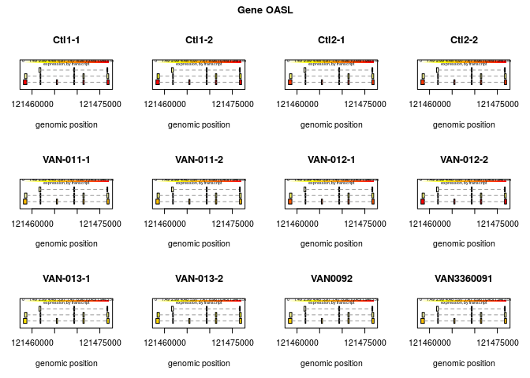
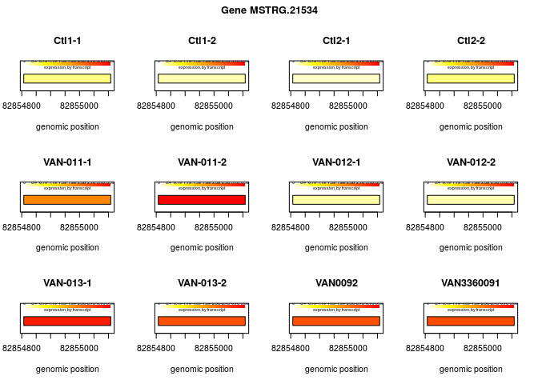
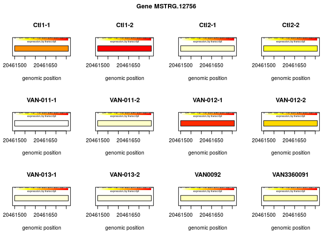
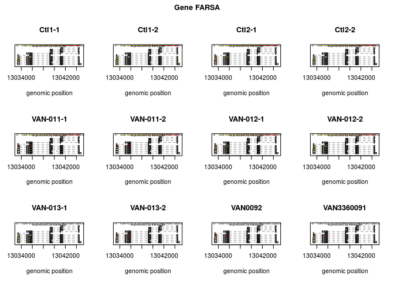
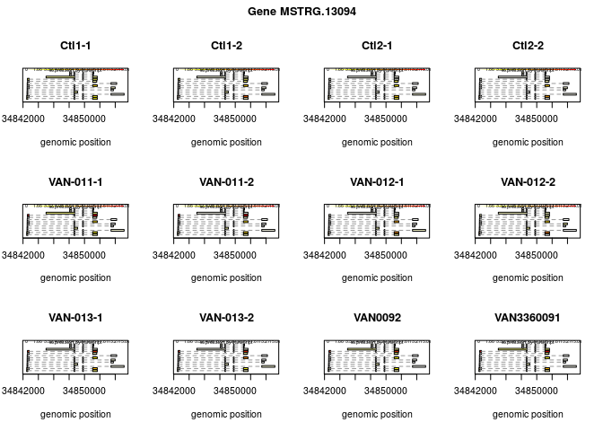
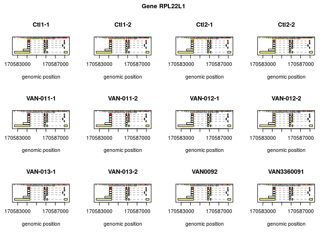

HISAT2-StringTie-Ballgown analysis
================
German Novakovskiy
June 18, 2018

RNA-seq analysis with Ballgown
==============================

``` r
suppressMessages(suppressWarnings(library(AnnotationDbi)))
suppressMessages(suppressWarnings(library(org.Hs.eg.db)))
suppressMessages(suppressWarnings(library(dplyr)))
suppressMessages(suppressWarnings(library(knitr)))
suppressMessages(suppressWarnings(library(tximport)))
suppressMessages(suppressWarnings(library(ballgown)))
suppressMessages(suppressWarnings(library(tibble)))
suppressMessages(suppressWarnings(library(reshape2)))
suppressMessages(suppressWarnings(library(ggplot2)))
suppressMessages(suppressWarnings(library(RColorBrewer)))
suppressMessages(suppressWarnings(library(ermineR)))
suppressMessages(suppressWarnings(library(tidyverse)))
suppressMessages(suppressWarnings(library(tximport)))
suppressMessages(suppressWarnings(library(readr)))
suppressMessages(suppressWarnings(library(tximportData)))
suppressMessages(suppressWarnings(library(GenomicFeatures)))
suppressMessages(suppressWarnings(library(biomaRt)))
suppressMessages(suppressWarnings(library(gplots)))
suppressMessages(suppressWarnings(library(geneplotter)))
suppressMessages(suppressWarnings(library(fdrtool)))
suppressMessages(suppressWarnings(library(genefilter)))
suppressMessages(suppressWarnings(library(topGO)))
suppressMessages(suppressWarnings(library(devtools)))
suppressMessages(suppressWarnings(library(RSkittleBrewer)))
```

Running HISAT2 (genome alignment)
---------------------------------

Remove all \# for running:

``` bash
##Downloading genome for hisat2
#curl ftp://ftp.ensembl.org/pub/grch37/release-92/fasta/homo_sapiens/dna/Homo_sapiens.GRCh37.dna_sm.primary_assembly.fa.gz -o Homo_sapiens.GRCh37.dna_sm.primary_assembly.fa.gz

##Downloading transcriptome annotation
#curl ftp://ftp.ensembl.org/pub/grch37/release-92/gtf/homo_sapiens/Homo_sapiens.GRCh37.87.gtf.gz -o genes_92_19.gtf.gz

##indexing genome with hisat2
#hisat2-build -p 8 Homo_sapiens.GRCh38.dna_sm.primary_assembly.fa Homo_sapiens.GRCh38.dna_sm.primary_assembly
```

Running HISAT2. Remove all \# for running, except first line (when it's \#!/bin/bash):

``` bash
#!/bin/bash

#samples=($(ls good_reads))

#for i in "${samples[@]}"
#do

        #echo "Started with $i"

        ##all R1 reads for this sample from different libraries
        #TEST1=$(ls good_reads/"$i"/*R1* | tr '\n' ' ' | \
        #awk '{for(i=1;i<=NF;i++){printf $i;if(i<NF)printf ","}}')

        ##all R2 reads for this sample from different libraries
        #TEST2=$(ls good_reads/"$i"/*R2* | tr '\n' ' ' | \
        #awk '{for(i=1;i<=NF;i++){printf $i;if(i<NF)printf ","}}')

        ##running hisat2 alignment of cdna reads
        #run_rnacocktail.py align --align_idx Homo_sapiens.GRCh37.dna_sm.primary_assembly --outdir hisat2_output \
        #--workdir hisat2_work --ref_gtf genes_92_19.gtf --1 $TEST1 \
        #--2 $TEST2 --hisat2 ../hisat2-2.0.5/hisat2 \
        #--hisat2_sps ../hisat2-2.0.5/hisat2_extract_splice_sites.py --samtools ../samtools-1.8/samtools --sample $i

        #echo '\n'
        #echo '\n'
        #echo "Done with $i"
        #echo '\n'
        #echo '\n'
#done
```

Running StringTie. Remove all \# for running, except first line (when it's \#!/bin/bash):

``` bash
#!/bin/bash

##Running StringTie for the first time
#samples=($(ls hisat2_output/hisat2))

#for i in "${samples[@]}"
#do

        #echo "Started with $i"

        #running stringtie with hisat2 alignment files
        #../stringtie-1.3.4d.Linux_x86_64/stringtie hisat2_output/hisat2/$i/alignments.sorted.bam \
        #-l $i -o stringtie_result/$i.gtf -G genes_92_19.gtf --rf -A actual_stringtie_test_out/$i.tab

        #echo "Done with $i"
        
#done

##Constructing merge list (what files to merge)
#ls -R stringtie_result | awk '
#/:$/&&f{s=$0;f=0}
#/:$/&&!f{sub(/:$/,"");s=$0;f=1;next}
#NF&&f{ print s"/"$0 }' > mergelist.txt

##merge gtf files for different samples
#../stringtie-1.3.4d.Linux_x86_64/stringtie --merge -G genes_92_19.gtf -o stringtie_result/stringtie_merged.gtf mergelist.txt

##run gffcompare to compare merged gtf file with reference gtf file (genes_92_19.gtf)
#../comparegff/gffcompare/gffcompare -r genes_92_19.gtf -o compare_res stringtie_result/stringtie_merged.gtf

##rerunning stringtie with merged gtf (-e is used, because now we want to quantifu only transcripts from
##the merged file)
##-B parameter is used in order to generate files for Ballgown
#for j in "${samples[@]}"
#do

        #echo "Started with $j"

        #RErunning stringtie with hisat2 alignment files and new merged gtf file
        #../stringtie-1.3.4d.Linux_x86_64/stringtie hisat2_output/hisat2/$j/alignments.sorted.bam \
        #-e -B -o stringtie_result_merged/$j/$j.gtf -G stringtie_result/stringtie_merged.gtf --rf

        #echo "Done with $j"

#done

##counting transcripts and genes for DESeq2 (45 is an average read length for this libraries)
#python prepDE.py -i prepde_input.txt -l 45 
```

Results of gffcompare:

``` bash
less ~/RNA-seq_Cynthia/compare_res.stats
```

    ## # gffcompare v0.10.5 | Command line was:
    ## #../comparegff/gffcompare/gffcompare -r genes_92_19.gtf -o compare_res stringtie_result/stringtie_merged.gtf
    ## #
    ## 
    ## #= Summary for dataset: stringtie_result/stringtie_merged.gtf 
    ## #     Query mRNAs :  210411 in   60203 loci  (179738 multi-exon transcripts)
    ## #            (20583 multi-transcript loci, ~3.5 transcripts per locus)
    ## # Reference mRNAs :  193932 in   54888 loci  (169009 multi-exon)
    ## # Super-loci w/ reference transcripts:    47928
    ## #-----------------| Sensitivity | Precision  |
    ##         Base level:   100.0     |    92.8    |
    ##         Exon level:   100.0     |    97.7    |
    ##       Intron level:    99.4     |    98.9    |
    ## Intron chain level:   100.0     |    94.0    |
    ##   Transcript level:   100.0     |    92.2    |
    ##        Locus level:   100.0     |    90.9    |
    ## 
    ##      Matching intron chains:  169009
    ##        Matching transcripts:  193932
    ##               Matching loci:   54888
    ## 
    ##           Missed exons:       0/559596   (  0.0%)
    ##            Novel exons:    6408/576494   (  1.1%)
    ##         Missed introns:    1964/343812   (  0.6%)
    ##          Novel introns:     459/345588   (  0.1%)
    ##            Missed loci:       0/54888    (  0.0%)
    ##             Novel loci:    4177/60203    (  6.9%)
    ## 
    ##  Total union super-loci across all input datasets: 60203 
    ## 210411 out of 210411 consensus transcripts written in compare_res.annotated.gtf (0 discarded as redundant)

High sensitivity here means that all of the StringTie transcripts match the known transcripts (in genes\_19\_92.gtf annotation file). The precision is lower (but not much) indicating that many of the StringTie transcripts are not in the list of known transcripts, which are either false positives or truly de novo transcripts (we see that there are not a lot of them). The novel exons, introns, and loci indicate how many of the sites were not found in the list of known transcripts.

Ballgown analysis of transcripts
--------------------------------

``` r
#metadata construction
ids <- c("Ctl1-1", "Ctl1-2", "Ctl2-1", "Ctl2-2", "VAN-011-1", "VAN-011-2",
             "VAN-012-1", "VAN-012-2", "VAN-013-1", "VAN-013-2", "VAN0092", "VAN3360091")
#ballgown is not good in handling technical replicates, thus I will include
#an additional column here
samples <- c("Ctl1", "Ctl1", "Ctl2", "Ctl2", "VAN011", "VAN011",
             "VAN012", "VAN012", "VAN013", "VAN013", "VAN0092", "VAN0092")
sex <- c("M", "M", "M", "M", "F", "F", "F", "F", "M", "M", "F", "F")
national <- c("Caucasian", "Caucasian", "Asian", "Asian",
              "Caucasian", "Caucasian", "Caucasian", "Caucasian",
              "Caucasian", "Caucasian", "Caucasian", "Caucasian")
relation <- c("NoFamily", "NoFamily", "NoFamily", "NoFamily",
              "Family", "Family", "Family", "Family",
              "Family", "Family", "Family", "Family")

#1 is affected, 0 if not
affected <- c(0, 0, 0, 0, 1, 1, 0, 0, 1, 1, 1, 1)
rep <- c(1, 1, 2, 2, 3, 3, 4, 4, 5, 5, 6, 6)
metadata <- data.frame(Ids = ids, Samples = samples, National = national,
                       Relation = relation, Sex = sex, Affected = affected, Replicate = rep)
metadata$Affected <- as.factor(metadata$Affected)
metadata$Samples <- as.factor(metadata$Samples)
metadata$Replicate <- as.factor(metadata$Replicate)
rownames(metadata) <- ids
metadata
```

    ##                   Ids Samples  National Relation Sex Affected Replicate
    ## Ctl1-1         Ctl1-1    Ctl1 Caucasian NoFamily   M        0         1
    ## Ctl1-2         Ctl1-2    Ctl1 Caucasian NoFamily   M        0         1
    ## Ctl2-1         Ctl2-1    Ctl2     Asian NoFamily   M        0         2
    ## Ctl2-2         Ctl2-2    Ctl2     Asian NoFamily   M        0         2
    ## VAN-011-1   VAN-011-1  VAN011 Caucasian   Family   F        1         3
    ## VAN-011-2   VAN-011-2  VAN011 Caucasian   Family   F        1         3
    ## VAN-012-1   VAN-012-1  VAN012 Caucasian   Family   F        0         4
    ## VAN-012-2   VAN-012-2  VAN012 Caucasian   Family   F        0         4
    ## VAN-013-1   VAN-013-1  VAN013 Caucasian   Family   M        1         5
    ## VAN-013-2   VAN-013-2  VAN013 Caucasian   Family   M        1         5
    ## VAN0092       VAN0092 VAN0092 Caucasian   Family   F        1         6
    ## VAN3360091 VAN3360091 VAN0092 Caucasian   Family   F        1         6

Read in the expression data that were calculated by StringTie:

``` r
dir <- "~/RNA-seq_Cynthia/ballgown"
files <- file.path(dir, metadata$Ids)
files
```

    ##  [1] "~/RNA-seq_Cynthia/ballgown/Ctl1-1"    
    ##  [2] "~/RNA-seq_Cynthia/ballgown/Ctl1-2"    
    ##  [3] "~/RNA-seq_Cynthia/ballgown/Ctl2-1"    
    ##  [4] "~/RNA-seq_Cynthia/ballgown/Ctl2-2"    
    ##  [5] "~/RNA-seq_Cynthia/ballgown/VAN-011-1" 
    ##  [6] "~/RNA-seq_Cynthia/ballgown/VAN-011-2" 
    ##  [7] "~/RNA-seq_Cynthia/ballgown/VAN-012-1" 
    ##  [8] "~/RNA-seq_Cynthia/ballgown/VAN-012-2" 
    ##  [9] "~/RNA-seq_Cynthia/ballgown/VAN-013-1" 
    ## [10] "~/RNA-seq_Cynthia/ballgown/VAN-013-2" 
    ## [11] "~/RNA-seq_Cynthia/ballgown/VAN0092"   
    ## [12] "~/RNA-seq_Cynthia/ballgown/VAN3360091"

``` r
bg <-  ballgown(dataDir = "~/RNA-seq_Cynthia/ballgown", 
                samples = files, 
                pData = metadata)
```

    ## Tue Jun 19 11:59:51 2018

    ## Tue Jun 19 11:59:51 2018: Reading linking tables

    ## Tue Jun 19 11:59:55 2018: Reading intron data files

    ## Tue Jun 19 12:00:08 2018: Merging intron data

    ## Tue Jun 19 12:00:11 2018: Reading exon data files

    ## Tue Jun 19 12:00:46 2018: Merging exon data

    ## Tue Jun 19 12:00:50 2018: Reading transcript data files

    ## Tue Jun 19 12:01:06 2018: Merging transcript data

    ## Wrapping up the results

    ## Tue Jun 19 12:01:08 2018

``` r
bg
```

    ## ballgown instance with 210411 transcripts and 12 samples

Filter to remove low-abundance genes. Here we remove all transcripts with a variance across samples less than one:

``` r
bg_filt = subset(bg,"rowVars(texpr(bg)) >1",genomesubset=TRUE)

bg_filt
```

    ## ballgown instance with 32734 transcripts and 12 samples

Identify transcripts that show statistically significant differences between groups.Note that Ballgown’s statistical test is a standard linear model-based comparison. For small sample sizes (n &lt; 4 per group), it is often better to perform regularization.

``` r
results_transcripts = stattest(bg_filt, feature="transcript",covariate="Affected",
                               adjustvars =c("Sex"), getFC=TRUE, meas="FPKM")
```

Add gene names and gene IDs to the results\_transcripts data frame:

``` r
results_transcripts <-  data.frame(geneNames=ballgown::geneNames(bg_filt),
                                   geneIDs=ballgown::geneIDs(bg_filt), results_transcripts)
```

Sort the results from the smallest P value to the largest:

``` r
results_transcripts <- arrange(results_transcripts,qval)
head(results_transcripts, 10)
```

    ##    geneNames     geneIDs    feature     id        fc         pval
    ## 1          . MSTRG.21534 transcript 143824 2.9081830 6.613865e-07
    ## 2          . MSTRG.12756 transcript  84373 0.3098086 2.198740e-06
    ## 3      FARSA MSTRG.15325 transcript 101577 0.2470264 1.872403e-06
    ## 4       OASL  MSTRG.7548 transcript  49757 0.4752839 1.415905e-05
    ## 5          . MSTRG.13094 transcript  86159 7.0657908 1.333254e-05
    ## 6    RPL22L1 MSTRG.22213 transcript 148450 0.3541241 1.671187e-05
    ## 7          . MSTRG.19554 transcript 130962 2.7700407 2.543563e-05
    ## 8      SNX20 MSTRG.11653 transcript  76153 0.3546850 3.040009e-05
    ## 9          . MSTRG.24360 transcript 162983 0.3917457 3.858574e-05
    ## 10   TMEM14B MSTRG.25285 transcript 169069 0.3056526 4.783351e-05
    ##          qval
    ## 1  0.02164983
    ## 2  0.02399119
    ## 3  0.02399119
    ## 4  0.09117437
    ## 5  0.09117437
    ## 6  0.09117437
    ## 7  0.11894426
    ## 8  0.12438958
    ## 9  0.14034063
    ## 10 0.14234381

``` r
plotTranscripts(ballgown::geneIDs(bg)[49757], bg, main=c('Gene OASL'), sample=ids)
```



``` r
#3rd chromosome (start-end 82854807 82855108), 1 exon, probably FP
plotTranscripts(ballgown::geneIDs(bg)[143824], bg, main=c('Gene MSTRG.21534'), sample=ids)
```



``` r
#17th chromosome (start-end 20461500    20461760), 1 exon, probably FP
plotTranscripts(ballgown::geneIDs(bg)[84373], bg, main=c('Gene MSTRG.12756'), sample=ids)
```



``` r
plotTranscripts(ballgown::geneIDs(bg)[101577], bg, main=c('Gene FARSA'), sample=ids)
```



``` r
#17 chromosome (gene name ZNHIT3)
plotTranscripts(ballgown::geneIDs(bg)[86159], bg, main=c('Gene MSTRG.13094'), sample=ids)
```



``` r
#17 chromosome (gene name ZNHIT3)
plotTranscripts(ballgown::geneIDs(bg)[148450], bg, main=c('Gene RPL22L1'), sample=ids)
```


